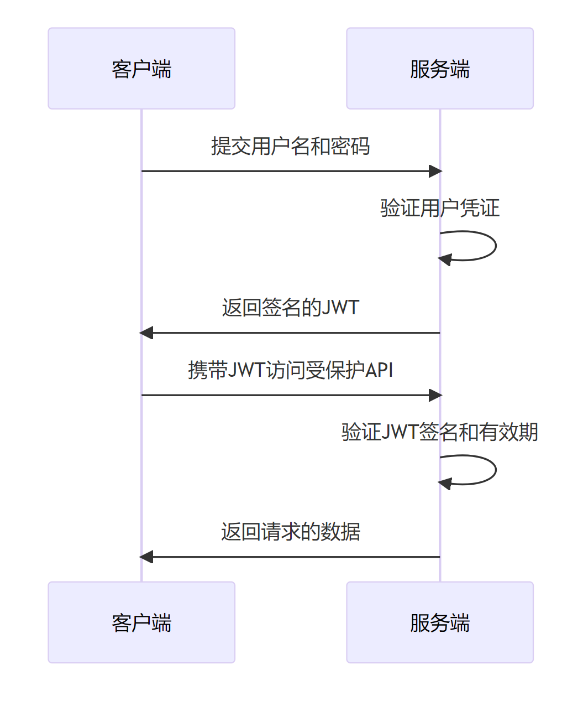

# 前端JWT
## 一、为什么JWT成为现代Web开发的首选？

JWT 全称 JSON Web Token，是一种基于 JSON 的轻量级身份认证规范。它就像我们进出小区的门禁卡 —— 初次登录时由服务器发放，之后访问需要权限的区域时，只需出示这张 "门禁卡" 即可，无需每次都重复验证身份。

与传统的 Session 认证相比，JWT 有三个显著优势：

* **无状态**：服务器不需要存储会话信息，减轻服务器负担
* **跨域支持**：特别适合前后端分离和分布式系统
* **自包含**：可以在 token 中包含必要的用户信息，减少数据库查询

看看我们日常开发中常见的场景：登录后才能访问个人中心、管理员页面需要特定权限、API 接口需要身份验证 —— 这些都可以通过 JWT 优雅地实现。

## 二、JWT 认证流程

让我们结合实际代码，看看 JWT 在真实项目中是如何工作的。以下是一个完整的认证流程图：

### 1. 登录认证（获取 JWT）

当用户输入用户名和密码点击登录时，前端会发送认证请求到服务器。我们来看后端的处理逻辑：

```js
// 登录接口的mock实现
{
  url: '/api/login',
  method: 'post',
  response: (req, res) => {
    const { username, password } = req.body;
    // 验证用户名密码
    if(username !== 'admin' || password !== '123456') {
      return {
        code: 1,
        message: '用户名或密码错误',
        data: null
      }
    }
    // 验证通过，生成JWT
    const token = sign(
      {
        user: {
          id: "001",
          username: "admin"
        }
      },
      secret,          // 密钥，服务器端保存
      { expiresIn: '2h' }  // 过期时间
    );
    return {
      code: 0,
      message: 'success',
      data: {
        token: token,  // 返回生成的token
        user: {
          id: '001',
          username: 'admin' 
        }
      }
    };
  }
}
```

这段代码的核心是`sign`方法，它接收三个参数：

* 第一个参数：要存储的用户信息（payload）
* 第二个参数：密钥（secret），用于签名
* 第三个参数：配置项，这里设置了 2 小时后过期

生成的 JWT 实际上是一个字符串，由三部分组成，用点分隔：

* Header（头部）：指定算法
* Payload（载荷）：用户信息和过期时间等
* Signature（签名）：用密钥对前两部分加密的结果

### 2. 前端存储与携带 JWT

登录成功后，前端需要保存 JWT，并在后续请求中携带它。通常我们会使用 axios 拦截器统一处理：

```js
// axios配置文件
import axios from 'axios';
axios.defaults.baseURL = 'http://localhost:5173/api'

// 请求拦截器
axios.interceptors.request.use(
  config => {
    // 从localStorage获取token
    const token = localStorage.getItem('token') || '';
    if (token) {
      // 按规范添加Bearer前缀
      config.headers.Authorization = `Bearer ${token}`;
    }
    return config;
  },
  error => {
    return Promise.reject(error);
  }
);
export default axios;
```

这里有个细节：我们在 token 前添加了`Bearer `前缀，这是 OAuth 2.0 规范的要求，大多数后端框架都会遵循这个约定。

### 3. 权限验证与资源访问

当访问需要权限的接口时（比如`/api/user`），服务器会验证 JWT 的有效性：

```js
{
  url: '/api/user',
  method: 'get',
  response: (req, res) => {
    // 从请求头获取token
    const token = req.headers["authorization"].split(" ")[1];
    try {
      // 验证并解码token
      const decoded = decode(token, secret);
      return {
        code: 0,
        message: 'success',
        data: {  
          user: decoded.user 
        }
      };
    } catch(err) {
      return {
        code: 1,
        message: err.message,
        data: null
      }
    }
  }
}
```

服务器通过密钥验证 token 的完整性和有效性，如果验证通过就返回请求的资源，否则返回错误信息。

### 4. 路由级别的权限控制

除了接口验证，我们通常还需要在路由层面控制访问权限。可以用一个高阶组件实现：

```js
import { useUserStore } from "../../store/userStore"
import { useEffect } from "react"
import { useNavigate, useLocation } from "react-router-dom"

const RequireAuth = ({ children }) => {
  const { isLogin } = useUserStore()
  const navigate = useNavigate()
  const { pathname } = useLocation()

  useEffect(() => {
    // 如果未登录，重定向到登录页
    if (!isLogin) {
      navigate('/login', { from: pathname })
    }
  }, [isLogin, navigate, pathname])

  return <>{children}</>
}

export default RequireAuth
```

使用时只需包裹需要权限的路由：

```jsx
<Route 
  path="/profile" 
  element={
    <RequireAuth>
      <Profile />
    </RequireAuth>
  } 
/>
```

这样就实现了 "未登录时无法访问受保护页面" 的功能。

## 三、JWT 为什么能保证安全？

很多人会有疑问：JWT 看起来就是个字符串，难道不能被篡改吗？要理解这个问题，我们需要深入了解 JWT 的签名机制。

JWT 的签名过程是这样的：

1. 服务器使用指定的算法（默认 HS256），将 Header 和 Payload 进行编码
2. 用服务器端保存的 secret（密钥）对编码后的字符串进行加密，生成 Signature
3. 最终的 JWT 是 Header 编码 + "." + Payload 编码 + "." + Signature

当客户端发送 JWT 到服务器时，服务器会：

1. 提取 Header 和 Payload 部分
2. 使用相同的算法和 secret 重新计算签名
3. 比较计算出的签名与 JWT 中的签名是否一致

如果有人篡改了 Payload，那么服务器计算出的签名就会与 JWT 中的签名不一致，验证就会失败。这就是 JWT 保证数据完整性的原理。

## 四、双Token刷新机制

### 1. 为什么需要Refresh Token？

JWT 通常会设置过期时间（比如 2 小时），但频繁让用户重新登录会影响体验。这时候就需要刷新机制（Refresh Token）：

* **Access Token**：短期有效（如2天），用于API访问
* **Refresh Token**：长期有效（如7天），用于获取新的Access Token

### 2. 双Token工作流程

实现思路：

1. 登录时服务器返回两个 token：

   * Access Token：短期有效（如 2 小时），用于访问资源
   * Refresh Token：长期有效（如 7 天），用于获取新的 Access Token

2. 当 Access Token 过期时，客户端使用 Refresh Token 向服务器请求新的 Access Token

3. 如果 Refresh Token 也过期了，才要求用户重新登录

### 3. 代码实现示例

服务端签发双Token：

```javascript
// 生成accessToken
const accessToken = jwt.sign(
  { userId: '123' },
  'access_secret',
  { expiresIn: '2h' }
);

// 生成refreshToken
const refreshToken = jwt.sign(
  { userId: '123', tokenType: 'refresh' },
  'refresh_secret',
  { expiresIn: '7d' }
);
```

前端自动刷新逻辑：

```javascript
axios.interceptors.response.use(
  response => response,
  async error => {
    if (error.response.status === 401) {
      try {
        const newToken = await refreshToken();
        localStorage.setItem('accessToken', newToken);
        error.config.headers.Authorization = `Bearer ${newToken}`;
        return axios(error.config);
      } catch (e) {
        localStorage.clear();
        window.location.href = '/login';
      }
    }
    return Promise.reject(error);
  }
);
```

## 五、JWT vs Session：核心区别与面试常见问题

### 1. 核心区别对比

| 特性     | JWT     | Session       |
| ------ | ------- | ------------- |
| 存储位置   | 客户端     | 服务端           |
| 扩展性    | 适合分布式系统 | 需要共享Session存储 |
| CSRF防护 | 天然免疫    | 需要额外防护        |
| 数据安全   | 需防范XSS  | 更安全           |
| 性能     | 无需查库    | 通常需要查库        |

### 2. 常见面试题

**Q1：如何实现JWT的主动失效？**

A：虽然JWT设计为无状态，但仍可通过以下方式实现主动失效：

* 维护短期token黑名单
* 使用refreshToken轮换机制
* 在payload中加入版本号或时间戳

**Q2：JWT的最大安全问题是什么？如何防范？**

A：最大的安全风险是XSS攻击导致token被盗。防范措施包括：

* 使用[HttpOnly Cookie](./HttpOnly-Cookie.md)存储
* 设置合理的过期时间
* 实现IP绑定或设备指纹验证

**Q3：为什么JWT需要签名？**

A：签名确保令牌的完整性，防止中间人篡改payload数据。服务端通过验证签名可以确认token是否被修改过。

**Q4：什么是 Bearer Token？**
A：Bearer Token 是一种认证方案，表示 "持有者"（Bearer）只要拥有这个 token 就可以访问资源，JWT 通常会使用这种方案。

**Q5：JWT 的 Payload 可以存储敏感信息吗？**
A：不可以。Payload 只是经过 Base64 编码，并没有加密，任何人都可以解码查看内容。

## 总结

安全是一个持续的过程，JWT只是解决方案的一部分，需要配合其他安全措施才能构建真正可靠的系统。
目前比JWT更安全的方案有PASETO（采用现代加密算法）、OAuth 2.0+OpenID Connect（适合企业级授权）和UUID+Redis（支持即时撤销），根据不同的业务场景选择不同的加密方案才是王道。
