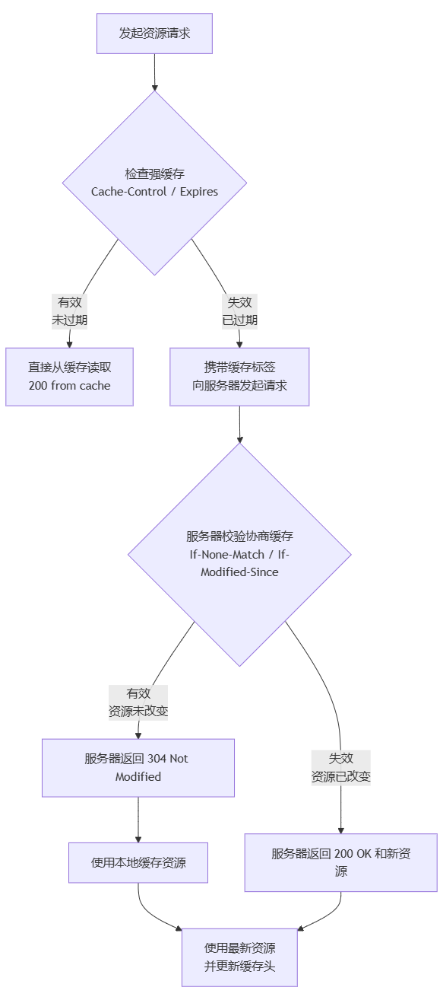

# HTTP缓存机制
---

### 1. 核心目标

HTTP缓存的核心目标有三个：
1.  **减少延迟：** 从本地缓存读取资源比从远程服务器获取快得多，从而加快页面加载速度。
2.  **降低带宽消耗：** 重复使用缓存的资源，减少了不必要的网络请求，为用户和服务器节省流量。
3.  **减轻服务器压力：** 更少的请求意味着服务器需要处理的负载更小。

---

### 2. 关键分类：强缓存与协商缓存

HTTP缓存主要分为两大类，它们的行为和优先级完全不同。

| 类别 | 核心思想 | 行为 | 相关Header |
| :--- | :--- | :--- | :--- |
| **强缓存** | **无需询问服务器，直接使用本地副本。** | 浏览器不会向服务器发送请求，直接从磁盘或内存缓存中读取资源。状态码：`200 (from disk cache)` 或 `200 (from memory cache)`。 | `Cache-Control`<br>`Expires` |
| **协商缓存** | **每次都需要询问服务器：“我缓存的这个版本还能用吗？”** | 浏览器会向服务器发送请求，如果资源未变，服务器返回 `304 Not Modified`，浏览器则使用缓存；如果已变，服务器返回 `200 OK` 和新资源。 | `Last-Modified` / `If-Modified-Since`<br>`ETag` / `If-None-Match` |

**重要关系：浏览器会优先检查强缓存，只有在强缓存失效后，才会发起请求并进入协商缓存阶段。**

---

### 3. 强缓存详解

强缓存通过两个HTTP头部控制，**`Cache-Control` 是现代Web开发中的首选和绝对主力**。

#### a) `Cache-Control` (HTTP/1.1引入)

这是一个通用头，既可以被服务器在响应中设置，也可以被客户端在请求中设置。它通过一系列指令来精确控制缓存行为。

**常见响应指令：**
*   `public`： 响应可以被任何对象（客户端、代理服务器等）缓存。
*   `private`： 响应只能被单个用户（浏览器）缓存，不能被代理服务器等共享缓存。通常用于个性化私密数据。
*   `no-cache`： **这个名字有误导性！** 它的意思是：**可以缓存，但在使用缓存副本前，必须先向服务器进行验证（即跳过强缓存，直接进入协商缓存）。**
*   `no-store`： **真正的“不缓存”**。不允许存储任何关于客户端请求和服务端响应的内容。安全级别最高。
*   `max-age=<seconds>`： **最重要的指令**。设置缓存存储的**最大周期**，单位为秒。相对于请求时间。例如 `max-age=3600` 表示资源可以被缓存1小时。
*   `s-maxage=<seconds>`： 与 `max-age` 类似，但仅适用于共享缓存（如CDN），优先级高于 `max-age`。
*   `must-revalidate`： 一旦缓存过期，在成功向原始服务器验证之前，不能使用旧副本。

**示例：**
```
Cache-Control: public, max-age=3600 // 公共缓存，有效期1小时
Cache-Control: no-cache              // 使用前必须验证
Cache-Control: no-store              // 绝不缓存
Cache-Control: private, max-age=86400 // 私有缓存，有效期1天
```

#### b) `Expires` (HTTP/1.0引入)

*   **含义：** 指定一个资源的**绝对过期时间**（GMT格式）。
*   **问题：** 依赖服务器和客户端时钟严格同步，如果不同步，会导致缓存失效不准。**它是 `Cache-Control: max-age` 的备用方案，优先级更低。**

---

### 4. 协商缓存详解

当强缓存失效（`max-age`时间到），浏览器会携带缓存“证据”向服务器发起请求，询问资源是否变更。

#### a) `Last-Modified` / `If-Modified-Since`

*   **工作原理：**
    1.  **首次请求：** 服务器在响应头中返回 `Last-Modified: <GMT time>`，告知资源最后修改时间。
    2.  **再次请求：** 浏览器在请求头中带上 `If-Modified-Since: <Last-Modified value>`。
    3.  **服务器校验：** 服务器比较资源的当前最后修改时间和 `If-Modified-Since` 的值。
        *   如果时间一致，返回 `304 Not Modified`，响应体为空。
        *   如果不一致，返回 `200 OK` 和新的资源内容，并更新 `Last-Modified` 头。

*   **缺陷：**
    1.  **精度到秒：** 如果文件在1秒内修改多次，无法准确识别。
    2.  **内容未变，时间改变：** 有时文件可能只是被`touch`了一下，内容没变，但修改时间变了，导致不必要的重新下载。

#### b) `ETag` / `If-None-Match` (更精确、优先级更高)

为了解决 `Last-Modified` 的缺陷，HTTP/1.1引入了 `ETag`。

*   **工作原理：**
    1.  **首次请求：** 服务器在响应头中返回 `ETag: "xyz123"`。这个值通常是文件内容的哈希值或版本号。
    2.  **再次请求：** 浏览器在请求头中带上 `If-None-Match: "xyz123"`。
    3.  **服务器校验：** 服务器计算当前资源的ETag，并与 `If-None-Match` 的值比较。
        *   如果一致，返回 `304 Not Modified`。
        *   如果不一致，返回 `200 OK` 和新的资源内容，并更新 `ETag` 头。

*   **优势：**
    *   精度极高，只要内容不变，ETag就不会变。
    *   能准确感知内容的变化。

**注意：** 当 `ETag` 和 `Last-Modified` 同时存在时，**`ETag` 的优先级更高**。

---

### 5. 完整的缓存决策流程图

为了更直观地理解整个流程，我们可以想象浏览器发起一个资源请求时的决策过程：


---

### 6. 前端实践与缓存策略

对于不同类型的资源，我们应该采用不同的缓存策略，这被称为“缓存配方”。

| 资源类型 | 策略 | 示例 |
| :--- | :--- | :--- |
| **HTML文件** | `no-cache` 或 `max-age=0` | `Cache-Control: no-cache` <br>确保用户总能获取到最新的页面结构，但通过协商缓存节省带宽。 |
| **CSS、JS、图片** | **强缓存 + 文件名哈希** | `Cache-Control: public, max-age=31536000` <br>（一年）并设置 `immutable`。通过构建工具（Webpack/Vite）在文件名中加入哈希值，这样内容一变，文件名就变，URL就变了，强制浏览器下载新文件。这是**最有效的策略**。 |
| **API接口数据** | **通常 `no-store` 或 `private, no-cache`** | `Cache-Control: no-store` <br>对于个性化、实时性要求高的数据，不缓存。对于列表等数据，可酌情短时间缓存。 |

**最佳实践：**
*   **利用构建工具进行“文件指纹”哈希：** 这是实现“永不失效”的强缓存的关键。`main.abc123.js` -> 内容变更 -> `main.def456.js`。
*   **CDN的重要性：** CDN边缘节点本身就是巨大的公有缓存 (`public`)，能极大加速静态资源的全球分发。
*   **谨慎使用 `v` 参数：** 如 `script.js?v=1.0.0`。这是一种“伪版本控制”，不如文件哈希可靠，因为它依赖于开发者手动更新版本号。

### 总结

HTTP缓存是一个由**强缓存**和**协商缓存**构成的精密系统。作为前端开发者，我们的核心任务是：
1.  **理解 `Cache-Control` 等关键头的含义。**
2.  **为不同资源制定并实施合理的缓存策略。**
3.  **利用现代构建工具，通过文件哈希实现最极致的静态资源缓存。**
