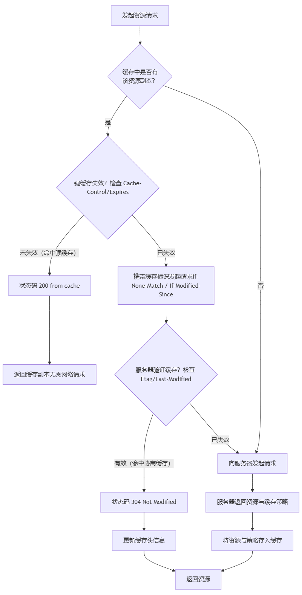

HTTP 缓存是前端性能优化中最为核心和有效的手段之一，它直接决定了资源是否需要从网络重新加载。一个设计良好的缓存策略可以极大提升用户体验并减轻服务器压力。

---

### 一、 缓存的位置

浏览器缓存主要涉及两个位置：

1.  **Disk Cache**：存储在硬盘上，容量大，但读取速度较慢。
2.  **Memory Cache**：存储在内存中，容量小，但读取速度极快。关闭标签页后数据会失效。

浏览器会根据资源的大小、类型等因素智能地决定将资源存放在哪个缓存中。

---

### 二、 核心缓存流程

一个完整的 HTTP 缓存决策流程，遵循着 **“先强缓存，后协商缓存”** 的逻辑。

这个流程确保了在资源未发生变化时，浏览器能以最快的速度（从本地缓存）加载资源，同时在资源更新后，能及时从服务器获取最新内容。

---

### 三、 缓存策略详解

#### 1. 强缓存

强缓存的核心是：**在缓存失效前，浏览器不会与服务器通信，直接使用本地缓存。** 这带来了极快的加载速度。

控制强缓存的 HTTP 头部主要有两个：

*   **`Cache-Control` (HTTP/1.1，优先级更高)**
    这是一个通用头，指令非常灵活，是现代 Web 开发的首选。
    *   `max-age=<seconds>`：缓存的最大生存时间，相对于请求的时间。例如 `max-age=31536000` 表示缓存一年。
    *   `public`：表明响应可以被任何对象（客户端、代理服务器等）缓存。
    *   `private`：表明响应只能被单个用户（浏览器）缓存，不能被代理服务器等共享缓存。
    *   `no-cache`：**不是不缓存，而是使用缓存前必须向服务器验证**（即跳过强缓存，直接进入协商缓存）。
    *   `no-store`：**真正的不缓存**，完全不使用任何缓存。每次都要从服务器重新下载。

*   **`Expires` (HTTP/1.0)**
    指定一个绝对的资源过期时间。
    *   `Expires: Wed, 21 Oct 2025 07:28:00 GMT`
    *   **缺点**：依赖客户端时间，如果客户端和服务器时间不同步，会导致缓存失效不准。现在基本被 `Cache-Control` 的 `max-age` 取代。

**工作流程**：浏览器检查 `Cache-Control` 和 `Expires`，判断缓存是否在有效期内。如果在，则 **命中强缓存**，返回 `200 OK (from memory/disk cache)`，**网络请求显示为灰色**。

#### 2. 协商缓存

当强缓存失效后，浏览器便会携带缓存标识向服务器发起请求，进行协商缓存。服务器根据标识判断资源是否变化。

控制协商缓存的头部有两组：

*   **`Etag` / `If-None-Match` (优先级更高)**
    *   `Etag`：服务器返回的资源标识符，通常是资源的哈希值或版本号。**它能精确感知字节级别的变化**。
    *   `If-None-Match`：客户端再次请求时，将上一次收到的 `Etag` 值放在此字段中发给服务器。
    *   **流程**：服务器比较当前资源的 `Etag` 和请求中的 `If-None-Match`。
        *   一致 -> 资源未变化 -> 返回 `304 Not Modified`，不返回资源体。
        *   不一致 -> 资源已变化 -> 返回 `200 OK` 和新的资源。

*   **`Last-Modified` / `If-Modified-Since`**
    *   `Last-Modified`：服务器返回的资源最后修改时间。
    *   `If-Modified-Since`：客户端再次请求时，将上一次收到的 `Last-Modified` 值放在此字段中发给服务器。
    *   **流程**：服务器比较当前资源的修改时间和 `If-Modified-Since`。
        *   时间相同或更晚 -> 返回 `304 Not Modified`。
    *   **缺点**：
        1.  精度到秒，如果1秒内文件多次变化，无法感知。
        2.  文件内容可能未变，但修改时间改变了（如 touch 操作），会导致不必要的重新下载。

**工作流程**：强缓存失效后，浏览器携带 `If-None-Match` 和 `If-Modified-Since` 发起请求。服务器验证后，若资源未变，则 **命中协商缓存**，返回 `304 Not Modified`，浏览器从缓存加载资源。**虽然产生了网络请求，但节省了传输资源体的流量**。

---

### 四、 实战缓存策略与版本号管理

如何为不同类型的资源设置缓存策略是前端工程化的关键。

#### 1. 哈希版本号策略

这是解决 **“资源更新后如何让用户获取最新内容”** 这一核心问题的银弹。

*   **原理**：在构建阶段，为静态资源（JS、CSS、图片）的文件名生成一个基于内容的哈希值。
    *   例如：`main.a1b2c3d4.js`, `style.e5f6g7h8.css`。
*   **效果**：
    *   **内容不变，哈希不变，文件名不变** -> 强缓存持续有效，用户命中缓存，性能最佳。
    *   **内容改变，哈希改变，文件名改变** -> 对于浏览器来说，这是一个全新的 URL，因此会绕过所有缓存，直接从服务器下载新文件。
*   **缓存策略**：对于带哈希的文件，可以设置**非常长的强缓存**，例如 `Cache-Control: max-age=31536000, immutable`（`immutable` 告诉浏览器资源永不变，无需再验证）。

#### 2. HTML 文件的缓存策略

HTML 通常是入口文件，它应该**禁用或使用极短的强缓存**（如 `no-cache` 或 `max-age=0`），并总是进行协商缓存。这样才能保证用户总能拿到最新的 HTML，从而通过其中引用的新哈希值资源文件来加载最新的静态资源。

#### 3. 通用策略总结

| 资源类型 | 缓存策略 | 解释 |
| :--- | :--- | :--- |
| **带哈希的 JS/CSS/图片** | `Cache-Control: max-age=31536000, immutable` | **永久缓存**。依靠文件名变化来更新。 |
| **不带哈希的 JS/CSS** | `Cache-Control: no-cache` | **总是验证**。依靠 `Etag` 或 `Last-Modified`。 |
| **HTML 文件** | `Cache-Control: no-cache` | **总是验证**。确保能获取到最新的资源引用。 |
| **API 接口数据** | `Cache-Control: no-cache` 或 `private, max-age=较短时间` | 根据数据实时性要求决定。通常需要验证。 |

### 总结

1.  **分层决策**：浏览器遵循 **强缓存 -> 协商缓存** 的流程，在速度和准确性之间取得最佳平衡。
2.  **强缓存是性能之王**：通过 `Cache-Control`（尤其是 `max-age`）实现，命中时无网络请求，体验最佳。
3.  **协商缓存是保险丝**：通过 `Etag`/`If-None-Match` 实现，在强缓存失效后，确保内容未变时能节省带宽。
4.  **版本号是基石**：**静态资源使用内容哈希命名 + 长周期强缓存** 是前端工程化中缓存实践的黄金法则。它完美解决了“更新”与“缓存”的矛盾。
