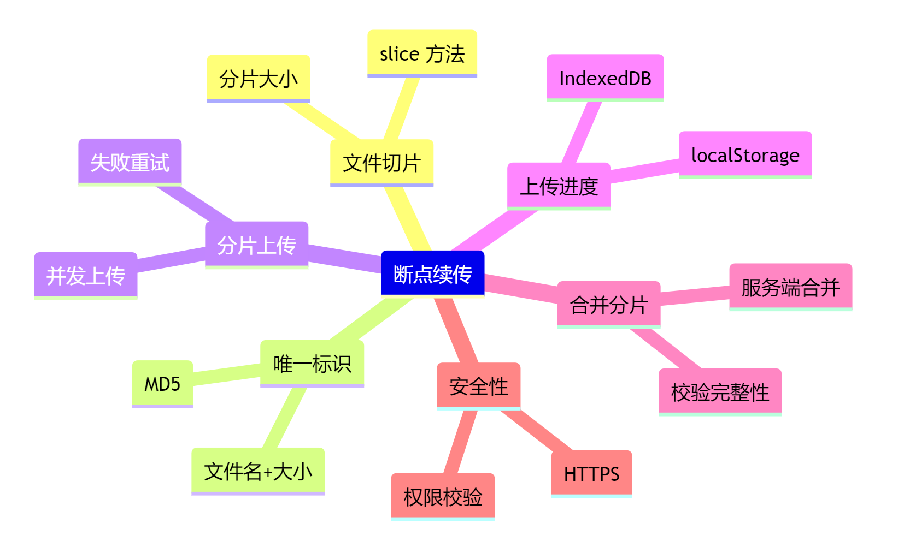

# 大文件断点续传

1）断点续传的核心思路

前端实现文件断点续传，主要是把大文件切分成多个小块（chunk），每个小块单独上传。上传过程中如果网络中断，只需要重新上传未完成的块，无需重头再来。这样可以提升大文件上传的可靠性和效率。

2）实现步骤

* 文件切片：使用 File 对象的 slice 方法，把文件分割成多个小块。
* 计算每个分片的唯一标识（如 MD5），用于服务端校验和断点续传。
* 逐块上传：每个分片通过接口单独上传，支持并发上传。
* 记录上传进度：前端保存已上传分片的信息，断网后可恢复上传。
* 合并文件：所有分片上传完成后，通知服务端进行合并。

3）安全性保障

* 上传过程中每个分片都可以校验哈希值，防止数据篡改。
* 支持 HTTPS，保证数据传输安全。
* 可以设置分片大小，避免单个请求过大导致失败。

4）代码示例

```javascript
// ... existing code ...
// 文件切片
function sliceFile(file, chunkSize = 2 * 1024 * 1024) {
  const chunks = [];
  let cur = 0;
  while (cur < file.size) {
    chunks.push(file.slice(cur, cur + chunkSize));
    cur += chunkSize;
  }
  return chunks;
}

// 上传单个分片
async function uploadChunk(chunk, index, fileHash) {
  const formData = new FormData();
  formData.append('file', chunk);
  formData.append('index', index);
  formData.append('fileHash', fileHash);
  // 这里用 fetch 发送请求
  return fetch('/api/upload-chunk', {
    method: 'POST',
    body: formData
  });
}

// 主流程
async function uploadFile(file) {
  const chunks = sliceFile(file);
  const fileHash = await calcFileHash(file); // 计算文件唯一标识
  // 并发上传所有分片
  await Promise.all(chunks.map((chunk, idx) => uploadChunk(chunk, idx, fileHash)));
  // 通知服务端合并
  await fetch('/api/merge-chunks', {
    method: 'POST',
    body: JSON.stringify({ fileHash, total: chunks.length }),
    headers: { 'Content-Type': 'application/json' }
  });
}
// ... existing code ...
```

## 扩展知识

### 1）分片上传的原理

分片上传是大文件上传的主流方案。前端将文件分割成多个小块，逐块上传，服务端收到所有分片后再合并。这样即使上传过程中断，也只需补传未完成的分片。

### 2）断点续传的关键点

* 前端要记录哪些分片已上传，哪些未上传。可以用 localStorage 或 IndexedDB 存储上传进度。
* 服务端要能识别每个分片（通常通过文件唯一标识+分片序号）。
* 上传失败时，前端可重试未完成的分片。

### 3）大文件安全上传的注意事项

* 使用 HTTPS 防止中间人攻击。
* 分片内容可加密，提升数据安全性。
* 上传接口要有权限校验，防止未授权访问。

### 4）常见的前端库

* spark-md5：用于计算文件的 MD5 值，生成唯一标识。
* axios：支持取消请求和进度监听，适合做分片上传。

### 5）Mermaid 思维导图


### 6）相关文档

* [MDN File.slice](https://developer.mozilla.org/zh-CN/docs/Web/API/File/slice)

* [spark-md5](https://github.com/satazor/js-spark-md5)

* [axios 官方文档](https://axios-http.com/zh/docs/intro)
