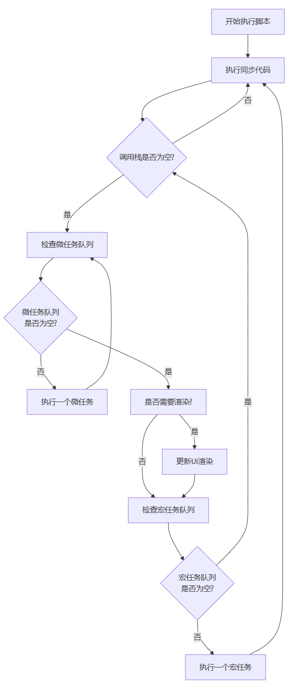

# 事件循环

---

### 1. 为什么需要事件循环？

JavaScript 是**单线程**的，这意味着它只有一个调用栈，同一时间只能做一件事。如果没有事件循环，遇到耗时操作（如网络请求、文件读取）时，整个程序就会阻塞。

**事件循环的解决方案：** 使用**异步回调**机制。将耗时操作交给其他线程（浏览器或 Node.js 提供）处理，主线程继续执行其他任务，当异步操作完成时，通过回调函数通知主线程。

---

### 2. 核心概念：调用栈、Web APIs、任务队列

为了理解事件循环，需要先了解三个核心部分：

#### a) 调用栈
- 这是一个**后进先出**的数据结构
- 用于跟踪当前正在执行的函数
- 当函数被调用时，它被压入栈顶；当函数返回时，它从栈顶弹出

#### b) Web APIs（浏览器环境）
- 由浏览器提供的异步能力，如：
  - `setTimeout`, `setInterval`
  - DOM 事件（点击、键盘等）
  - AJAX / Fetch 请求
  - `requestAnimationFrame`
- 这些 API 在**单独的线程**中执行，不会阻塞调用栈

#### c) 任务队列
- 包括：
  - **宏任务队列**
  - **微任务队列**
- 用于存放已完成的异步操作的回调函数

---

### 3. 完整的事件循环流程



这个流程可以简化为以下核心步骤：

1. **执行同步代码**（调用栈）
2. **执行所有微任务**（直到微任务队列为空）
3. **UI 渲染**（如果需要）
4. **执行一个宏任务**
5. 重复步骤 1-4

---

### 4. 宏任务 vs 微任务

#### 宏任务
- 包括：`setTimeout`, `setInterval`, `setImmediate` (Node.js), I/O 操作, UI 渲染, 事件回调
- **特点：** 每次事件循环只执行**一个**宏任务

#### 微任务
- 包括：`Promise.then/catch/finally`, `process.nextTick` (Node.js), `MutationObserver`
- **特点：** 每次事件循环会执行**所有**微任务（直到微任务队列为空）

**关键规则：微任务优先于宏任务执行**

---

### 5. 代码示例分析

让我们通过具体代码来理解这个机制：

#### 示例 1：基础执行顺序
```javascript
console.log('1. 同步代码开始');

setTimeout(() => {
  console.log('6. setTimeout - 宏任务');
}, 0);

Promise.resolve()
  .then(() => {
    console.log('4. Promise - 微任务 1');
  })
  .then(() => {
    console.log('5. Promise - 微任务 2');
  });

console.log('2. 同步代码结束');

// 输出顺序:
// 1. 同步代码开始
// 2. 同步代码结束
// 4. Promise - 微任务 1
// 5. Promise - 微任务 2
// 6. setTimeout - 宏任务
```

**执行过程分析：**
1. 同步代码执行：输出 1、2
2. 调用栈清空，检查微任务队列
3. 执行所有微任务：输出 4、5
4. 微任务队列清空，检查宏任务队列
5. 执行一个宏任务：输出 6

#### 示例 2：嵌套情况
```javascript
console.log('1. 开始');

setTimeout(() => {
  console.log('2. setTimeout');
  
  Promise.resolve()
    .then(() => {
      console.log('3. Promise in setTimeout');
    });
}, 0);

Promise.resolve()
  .then(() => {
    console.log('4. Promise');
    
    setTimeout(() => {
      console.log('5. setTimeout in Promise');
    }, 0);
  });

console.log('6. 结束');

// 输出顺序:
// 1. 开始
// 6. 结束
// 4. Promise
// 2. setTimeout
// 3. Promise in setTimeout
// 5. setTimeout in Promise
```

**执行过程分析：**
1. 同步代码：输出 1、6
2. 微任务队列：`[Promise回调]`
3. 执行微任务：输出 4，同时向宏任务队列添加新的 setTimeout
4. 宏任务队列：`[setTimeout1, setTimeout2]`
5. 执行第一个宏任务：输出 2，同时向微任务队列添加 Promise 回调
6. **关键：** 执行完一个宏任务后，再次检查微任务队列
7. 执行微任务：输出 3
8. 执行下一个宏任务：输出 5

---

### 6. 复杂场景分析

#### 示例 3：混合多种任务类型
```javascript
console.log('script start');

setTimeout(function() {
  console.log('setTimeout');
}, 0);

Promise.resolve().then(function() {
  console.log('promise1');
}).then(function() {
  console.log('promise2');
});

console.log('script end');

// 输出顺序:
// script start
// script end
// promise1
// promise2
// setTimeout
```

#### 示例 4：async/await 的本质
```javascript
async function async1() {
  console.log('async1 start');
  await async2();
  console.log('async1 end'); // 这行代码相当于在 Promise.then 中执行
}

async function async2() {
  console.log('async2');
}

console.log('script start');

setTimeout(function() {
  console.log('setTimeout');
}, 0);

async1();

new Promise(function(resolve) {
  console.log('promise1');
  resolve();
}).then(function() {
  console.log('promise2');
});

console.log('script end');

// 输出顺序:
// script start
// async1 start
// async2
// promise1
// script end
// async1 end  (微任务)
// promise2    (微任务)
// setTimeout  (宏任务)
```

**解释：** `await` 后面的代码相当于放在 `Promise.then()` 的回调中，属于微任务。

---

### 7. Node.js 与浏览器的事件循环差异

#### 浏览器事件循环：
- 相对简单：宏任务 → 微任务 → 渲染 → 重复
- 宏任务：`setTimeout`, `setInterval`, 事件回调, I/O
- 微任务：`Promise`, `MutationObserver`

#### Node.js 事件循环（更复杂）：
分为多个阶段，每个阶段执行特定类型的回调：

```
   ┌───────────────────────────┐
┌─>│ timers（定时器）          │ 执行 setTimeout/setInterval 回调
│  └───────────────────────────┘
│  ┌───────────────────────────┐
│  │ pending callbacks         │ 执行延迟到下一个循环的 I/O 回调
│  └───────────────────────────┘
│  ┌───────────────────────────┐
│  │ idle, prepare             │ 内部使用
│  └───────────────────────────┘
│  ┌───────────────────────────┐
│  │ poll（轮询）              │ 检索新的 I/O 事件，执行相关回调
│  └───────────────────────────┘
│  ┌───────────────────────────┐
│  │ check（检查）             │ 执行 setImmediate 回调
│  └───────────────────────────┘
│  ┌───────────────────────────┐
└──┤ close callbacks          │ 执行关闭事件的回调，如 socket.on('close')
   └───────────────────────────┘
```

**Node.js 特殊微任务：**
- `process.nextTick()`：比 Promise 优先级更高
- `Promise.then()`：标准的微任务

---

### 8. 实战技巧与注意事项

#### 避免阻塞事件循环
```javascript
// ❌ 错误：同步耗时操作会阻塞事件循环
function syncHeavyTask() {
  let result = 0;
  for (let i = 0; i < 1000000000; i++) {
    result += i;
  }
  return result;
}

// ✅ 正确：将耗时任务分解或使用 Worker
async function asyncHeavyTask() {
  // 使用 Web Worker 或分解任务
}
```

#### 合理使用微任务和宏任务
```javascript
// 需要立即执行的任务使用微任务
function urgentTask(callback) {
  Promise.resolve().then(callback);
}

// 不紧急的任务使用宏任务  
function deferTask(callback) {
  setTimeout(callback, 0);
}
```

### 总结

1. **单线程模型：** JavaScript 是单线程的，通过事件循环实现异步
2. **执行顺序：** 同步代码 → 所有微任务 → UI渲染 → 一个宏任务 → 重复
3. **任务分类：**
   - **宏任务：** `setTimeout`, `setInterval`, I/O, UI事件
   - **微任务：** `Promise`, `MutationObserver`, `process.nextTick`
4. **关键规则：** 微任务优先于宏任务执行
5. **async/await：** 本质是基于 Promise 的语法糖，属于微任务

