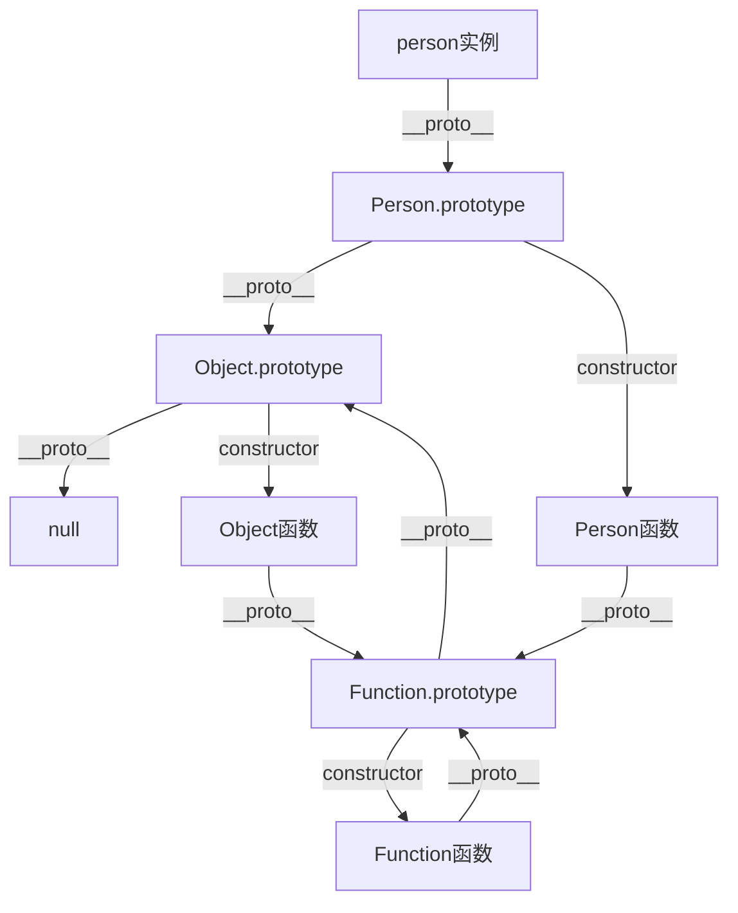

# 原型与原型链
---

### 第一部分：核心概念

#### 1. 原型

在 JavaScript 中，每个函数（除了一些[内建函数](./内建函数.md)）都有一个特殊的属性叫做 `prototype`（显式原型）。

*   **`prototype` 属性：**
    *   它是一个对象。
    *   它的主要用途是：当这个函数被用作构造函数，通过 `new` 关键字创建实例时，这个 `prototype` 对象会成为新实例的**原型**。

```javascript
function Person(name) {
  this.name = name;
}

// 函数的 prototype 属性
Person.prototype.sayHello = function() {
  console.log(`Hello, my name is ${this.name}`);
};

console.log(typeof Person.prototype); // "object"
console.log(Person.prototype); // { sayHello: [Function], constructor: [Function: Person] }
```

#### 2. `__proto__` 与 `[[Prototype]]`

*   **`[[Prototype]]`：** 这是 JavaScript 引擎内部的一个**隐藏属性**，指向该对象的原型。ECMA 标准中称之为 `[[Prototype]]`。我们无法直接访问它。
*   **`__proto__`:** 这是绝大多数浏览器提供的一个**非标准但被广泛实现的属性**，用于读取或设置对象的 `[[Prototype]]`。它指向创建该对象的构造函数的 `prototype`。

**重要关系：**
**实例的 `__proto__` 等于其构造函数的 `prototype`。**

```javascript
const person1 = new Person('Alice');
const person2 = new Person('Bob');

console.log(person1.__proto__ === Person.prototype); // true
console.log(person2.__proto__ === Person.prototype); // true
```

**最佳实践：** 现在，我们更推荐使用 `Object.getPrototypeOf(obj)` 来获取对象的原型，使用 `Object.setPrototypeOf(obj)` 来设置，而不是直接使用 `__proto__`。

```javascript
console.log(Object.getPrototypeOf(person1) === Person.prototype); // true
```

#### 3. `constructor` 属性

默认情况下，每个函数的 `prototype` 对象都会自动获得一个 `constructor` 属性，指回函数本身。

```javascript
console.log(Person.prototype.constructor === Person); // true
console.log(person1.constructor === Person); // true (通过原型链查找)
```

---

### 第二部分：原型链

原型链是 JavaScript 实现继承和属性查找的机制。

#### 1. 查找机制

当试图访问一个对象的属性时，它不仅仅在该对象上查找，还会沿着该对象的原型（`__proto__`）、原型的原型依次向上查找，直到找到匹配的属性名或到达原型链的尽头（`null`）。

**查找路径：**
`对象自身` -> `对象的__proto__` -> `对象的__proto__.__proto__` -> ... -> `null`

```javascript
function Person(name) {
  this.name = name;
}
Person.prototype.species = 'Homo Sapiens';

const person1 = new Person('Alice');

console.log(person1.name); // "Alice" (来自自身属性)
console.log(person1.species); // "Homo Sapiens" (来自 Person.prototype)
console.log(person1.toString()); // "[object Object]" (来自 Object.prototype)

// 查找过程：
// 1. person1 自身有 name，找到。
// 2. person1 自身没有 species，查找 person1.__proto__ (即 Person.prototype)，找到。
// 3. person1 自身没有 toString，查找 person1.__proto__，没有。再查找 person1.__proto__.__proto__ (即 Object.prototype)，找到。
```

#### 2. 完整的原型链图示

让我们通过代码和图示来理解一个完整的原型链。

```javascript
function Person(name) {
  this.name = name;
}
Person.prototype.sayHello = function() {};

const person = new Person('Alice');

// 原型链关系：
console.log(person.__proto__ === Person.prototype); // true
console.log(Person.prototype.__proto__ === Object.prototype); // true
console.log(Object.prototype.__proto__ === null); // true

// Person 函数本身的 __proto__ 是什么？
console.log(Person.__proto__ === Function.prototype); // true
console.log(Function.prototype.__proto__ === Object.prototype); // true
```

我们可以用以下 mermaid 图来清晰地展示这个关系：



**关键点：**
*   所有对象的原型链顶端都是 `Object.prototype`。
*   所有函数（包括 `Object`, `Function`）的原型都是 `Function.prototype`。
*   `Function.prototype` 是一个函数对象，但它的原型是 `Object.prototype`。
*   原型链的终点是 `null`。

---

### 第三部分：实践与应用

#### 1. 原型继承

这是 ES5 及之前实现继承的主要方式。

```javascript
// 父类
function Animal(name) {
  this.name = name;
}
Animal.prototype.eat = function() {
  console.log(`${this.name} is eating.`);
};

// 子类
function Dog(name, breed) {
  Animal.call(this, name); // 1. 继承父类实例属性 (构造函数窃取)
  this.breed = breed;
}

// 2. 继承父类原型方法 (关键步骤)
Dog.prototype = Object.create(Animal.prototype); // 创建一个以 Animal.prototype 为原型的空对象，赋值给 Dog.prototype
Dog.prototype.constructor = Dog; // 3. 修复 constructor 指向

// 子类新增方法
Dog.prototype.bark = function() {
  console.log('Woof!');
};

const myDog = new Dog('Rex', 'German Shepherd');
myDog.eat(); // "Rex is eating." (继承自 Animal.prototype)
myDog.bark(); // "Woof!" (自有方法)
console.log(myDog.constructor); // [Function: Dog] (正确)
```

#### 2. 属性屏蔽

当对象自身有一个属性，其原型上也有一个同名的属性时，会发生什么？

```javascript
function Parent() {}
Parent.prototype.value = 1;

const child = new Parent();
console.log(child.value); // 1 (来自原型)

child.value = 2; // 在自身创建属性，屏蔽原型上的属性
console.log(child.value); // 2 (来自自身)
console.log(child.hasOwnProperty('value')); // true

delete child.value; // 删除自身属性
console.log(child.value); // 1 (再次来自原型)
```

---

### 第四部分：ES6 Class 的底层

ES6 的 `class` 本质上是原型继承的**语法糖**。

```javascript
class Person {
  constructor(name) {
    this.name = name;
  }

  sayHello() {
    console.log(`Hello, ${this.name}`);
  }
}

// 等同于下面的 ES5 代码
/*
function Person(name) {
  this.name = name;
}
Person.prototype.sayHello = function() {
  console.log(`Hello, ${this.name}`);
};
*/
```

`class` 语法让面向对象编程和继承变得更清晰、更容易理解，但其底层依然遵循着原型和原型链的规则。

```javascript
class Student extends Person { // extends 关键字建立了原型链
  constructor(name, grade) {
    super(name); // 相当于 ES5 的 Animal.call(this, name)
    this.grade = grade;
  }
}

const student = new Student('Alice', 'A');
console.log(student instanceof Student); // true
console.log(student instanceof Person); // true (通过原型链)
console.log(Object.getPrototypeOf(Student.prototype) === Person.prototype); // true
```

### 总结

*   **原型：** 每个函数都有一个 `prototype` 属性，用于在通过 `new` 创建实例时，作为实例的原型。
*   **原型链：** 每个对象都有一个 `[[Prototype]]`（可通过 `__proto__` 访问），指向它的原型。属性查找会沿着这条链向上，直到 `null`。
*   **核心关系：** `实例.__proto__ === 构造函数.prototype`。
*   **继承本质：** JavaScript 的继承是通过将一个对象的原型指向另一个对象的实例（`SubType.prototype = new SuperType()` 或 `Object.create(SuperType.prototype)`）来实现的，从而形成原型链。
