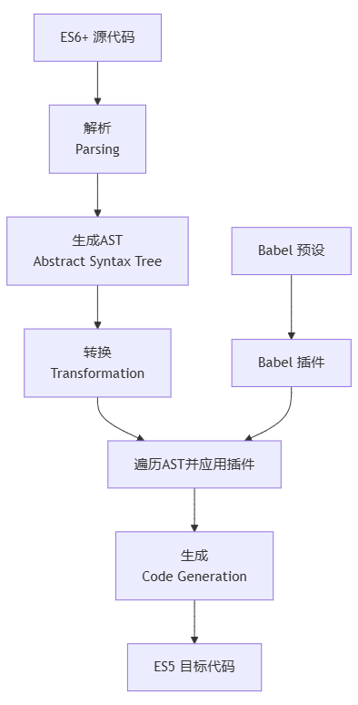

# Babel原理
Babel 的核心原理是将 **下一代 JavaScript 代码（ES6+）转换为当前和旧版浏览器或环境兼容的 JavaScript 代码**。

---

### 1. 核心概念：Babel 是什么？

**Babel 是一个 JavaScript 编译器**（更准确地说，是源码到源码的编译器，也称为"转译器"）。

**主要功能：**
- **语法转换：** 将 ES6+ 语法转换为 ES5 语法
- **特性补丁：** 通过 Polyfill 方式在目标环境中添加缺失的特性
- **源码转换：** JSX、TypeScript 等转换为普通 JavaScript

---

### 2. Babel 的完整工作流程

Babel 的转译过程遵循一个清晰的管道架构，可以用以下流程图表示：


这个流程可以分为三个核心阶段：

---

### 3. 阶段一：解析

**目的：** 将源代码转换为**抽象语法树**。

#### 解析过程：
1. **词法分析：** 将源代码字符串转换为 **tokens**（令牌流）
2. **语法分析：** 将 tokens 转换为 **AST**

#### 示例：
```javascript
// 源代码
const add = (a, b) => a + b;

// 词法分析生成的 tokens 大致如下：
[
  { type: 'Keyword', value: 'const' },
  { type: 'Identifier', value: 'add' },
  { type: 'Punctuator', value: '=' },
  { type: 'Punctuator', value: '(' },
  { type: 'Identifier', value: 'a' },
  { type: 'Punctuator', value: ',' },
  { type: 'Identifier', value: 'b' },
  { type: 'Punctuator', value: ')' },
  { type: 'Punctuator', value: '=>' },
  { type: 'Identifier', value: 'a' },
  { type: 'Punctuator', value: '+' },
  { type: 'Identifier', value: 'b' },
  { type: 'Punctuator', value: ';' }
]

// 语法分析生成的 AST（简化版）：
{
  type: "Program",
  body: [{
    type: "VariableDeclaration",
    declarations: [{
      type: "VariableDeclarator",
      id: { type: "Identifier", name: "add" },
      init: {
        type: "ArrowFunctionExpression",
        params: [
          { type: "Identifier", name: "a" },
          { type: "Identifier", name: "b" }
        ],
        body: {
          type: "BinaryExpression",
          operator: "+",
          left: { type: "Identifier", name: "a" },
          right: { type: "Identifier", name: "b" }
        }
      }
    }],
    kind: "const"
  }]
}
```

**使用的工具：** `@babel/parser`（以前叫 Babylon），基于 Acorn 扩展而来。

---

### 4. 阶段二：转换

**目的：** 对 AST 进行遍历和修改。

这是 Babel 最核心的阶段，通过 **访问者模式** 来实现。

#### 访问者模式：
Babel 使用访问者模式来遍历 AST，访问者是一个对象，它定义了用于获取特定节点的方法。

```javascript
// 一个简单的访问者示例
const visitor = {
  // 访问所有的箭头函数表达式
  ArrowFunctionExpression(path) {
    // 将箭头函数转换为普通函数
    path.replaceWith({
      type: 'FunctionExpression',
      params: path.node.params,
      body: path.node.body,
      async: path.node.async
    });
  },
  
  // 访问所有的常量声明
  VariableDeclaration(path) {
    // 将 const 改为 var
    if (path.node.kind === 'const') {
      path.node.kind = 'var';
    }
  }
};
```

#### Path 对象：
在访问者方法中，我们接收到的是 `path` 对象，而不是直接的节点。`path` 是节点在树中的位置和上下文的包装，提供了许多有用的方法：

```javascript
const visitor = {
  Identifier(path) {
    // path 对象的方法
    console.log(path.node.name);    // 访问节点
    path.replaceWith(newNode);      // 替换节点
    path.remove();                  // 删除节点
    path.insertBefore(newNode);     // 在前面插入节点
    path.insertAfter(newNode);      // 在后面插入节点
    path.skip();                    // 跳过子节点的遍历
    path.stop();                    // 停止遍历
    
    // 上下文信息
    console.log(path.parent);       // 父节点
    console.log(path.scope);        // 作用域信息
  }
};
```

#### 实际转换示例：
让我们看一个箭头函数转换的具体实现：

**输入代码：**
```javascript
const add = (a, b) => a + b;
```

**转换过程：**
```javascript
// Babel 插件中的访问者
const arrowFunctionPlugin = {
  visitor: {
    ArrowFunctionExpression(path) {
      const { node } = path;
      
      // 创建函数体块
      const body = node.body.type === 'BlockStatement' 
        ? node.body 
        : {
            type: 'BlockStatement',
            body: [{
              type: 'ReturnStatement',
              argument: node.body
            }]
          };
      
      // 创建普通函数表达式
      const functionExpression = {
        type: 'FunctionExpression',
        params: node.params,
        body: body,
        async: node.async,
        generator: node.generator
      };
      
      // 替换箭头函数
      path.replaceWith(functionExpression);
    }
  }
};
```

**输出代码：**
```javascript
const add = function(a, b) {
  return a + b;
};
```

---

### 5. 阶段三：生成

**目的：** 将转换后的 AST 转换回字符串形式的代码。

这个阶段相对简单，主要是深度优先遍历 AST，然后生成对应的代码字符串。

**使用的工具：** `@babel/generator`

```javascript
const generate = require('@babel/generator').default;

// 从 AST 生成代码
const output = generate(transformedAST, {
  retainLines: false,
  compact: "auto",
  concise: false,
  // ... 其他选项
});

console.log(output.code); // 生成的目标代码
```

---

### 6. Babel 的架构组成

#### 核心库：
- **`@babel/core`**: Babel 的核心库，包含整个转译流程
- **`@babel/parser`**: 负责解析阶段，将代码转换为 AST
- **`@babel/traverse`**: 负责转换阶段，遍历和修改 AST
- **`@babel/generator`**: 负责生成阶段，将 AST 转换回代码

#### 配置方式：
- **插件**：完成特定语法转换的最小单位
- **预设**：一组插件的集合

```javascript
// babel.config.js
module.exports = {
  presets: [
    [
      '@babel/preset-env',
      {
        targets: {
          browsers: ['last 2 versions', 'ie >= 11']
        },
        useBuiltIns: 'usage',
        corejs: 3
      }
    ]
  ],
  plugins: [
    '@babel/plugin-transform-arrow-functions',
    '@babel/plugin-transform-classes'
  ]
};
```

---

### 7. 插件开发实战

让我们手写一个简单的 Babel 插件：

#### 插件：将所有的 console.log 调用删除

```javascript
module.exports = function() {
  return {
    name: 'remove-console-plugin',
    visitor: {
      CallExpression(path) {
        const { node } = path;
        
        // 检查是否是 console.log
        if (node.callee.type === 'MemberExpression' &&
            node.callee.object.type === 'Identifier' &&
            node.callee.object.name === 'console' &&
            node.callee.property.type === 'Identifier' &&
            node.callee.property.name === 'log') {
          
          // 删除这个 console.log 调用
          path.remove();
        }
      }
    }
  };
};
```

#### 插件：将 var 转换为 let

```javascript
module.exports = function() {
  return {
    name: 'var-to-let-plugin',
    visitor: {
      VariableDeclaration(path) {
        if (path.node.kind === 'var') {
          path.node.kind = 'let';
        }
      }
    }
  };
};
```

---

### 8. Polyfill 机制

Babel 只能转换语法，对于新的 API（如 `Promise`, `Array.prototype.includes`）需要 Polyfill。

#### `@babel/polyfill`（已废弃） vs `core-js`

**现代方式：**
```javascript
// babel.config.js
module.exports = {
  presets: [
    [
      '@babel/preset-env',
      {
        useBuiltIns: 'usage', // 按需引入 polyfill
        corejs: 3,           // 指定 core-js 版本
        targets: {
          chrome: '58',
          ie: '11'
        }
      }
    ]
  ]
};
```

**工作原理：**
- 分析代码中使用的新 API
- 按需引入对应的 polyfill
- 避免打包整个 polyfill 库

---

### 9. 实际应用示例

让我们看一个完整的转换示例：

**输入（ES6+）：**
```javascript
class Person {
  constructor(name) {
    this.name = name;
  }
  
  sayHello = () => {
    console.log(`Hello, ${this.name}`);
  }
}

const person = new Person('Alice');
person.sayHello();
```

**经过 Babel 转换后（ES5）：**
```javascript
"use strict";

function _classCallCheck(instance, Constructor) {
  if (!(instance instanceof Constructor)) {
    throw new TypeError("Cannot call a class as a function");
  }
}

function _defineProperty(obj, key, value) {
  if (key in obj) {
    Object.defineProperty(obj, key, {
      value: value,
      enumerable: true,
      configurable: true,
      writable: true
    });
  } else {
    obj[key] = value;
  }
  return obj;
}

var Person = function Person(name) {
  _classCallCheck(this, Person);
  
  _defineProperty(this, "sayHello", function() {
    console.log("Hello, ".concat(this.name));
  });
  
  this.name = name;
};

var person = new Person('Alice');
person.sayHello();
```

---

### 总结

1. **解析**：源代码 → Tokens → AST（使用 `@babel/parser`）
2. **转换**：遍历 AST，应用插件进行修改（使用 `@babel/traverse` + 访问者模式）
3. **生成**：转换后的 AST → 目标代码（使用 `@babel/generator`）

**关键特点：**
- **插件化架构**：每个语法转换都是独立的插件
- **访问者模式**：优雅地遍历和修改 AST
- **Preset 预设**：插件集合，简化配置
- **Polyfill 机制**：处理新 API 的兼容性
