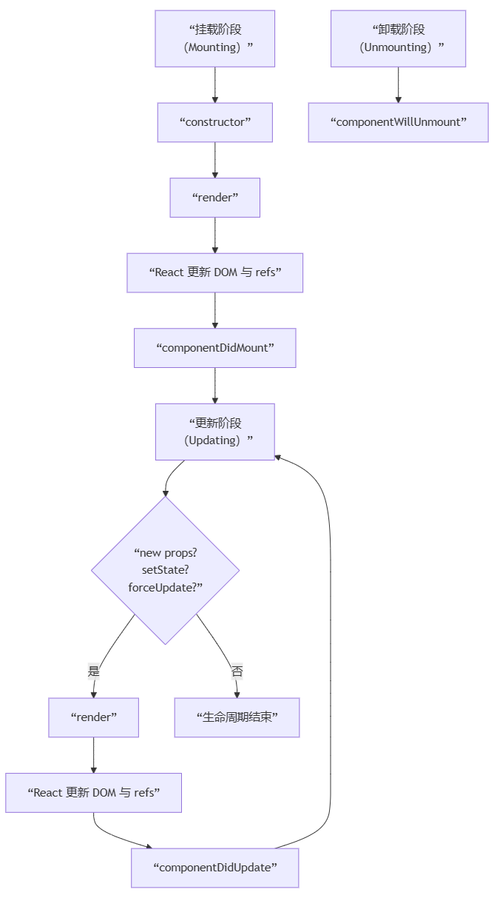

# React生命周期

1.  **传统类组件（Class Component）的生命周期**
2.  **现代函数组件（Function Component）与 Hooks 的“生命周期”思维**

---

### 第一部分：传统类组件（Class Component）的生命周期

类组件的生命周期方法可以被划分为三个主要阶段：**挂载（Mounting）**、**更新（Updating）** 和 **卸载（Unmounting）**。


#### 阶段一：挂载（Mounting） - 组件被创建并插入 DOM

当组件实例被创建并插入 DOM 时，其生命周期调用顺序如下：

1.  **`constructor(props)`**
    *   **目的**：初始化状态 (`this.state`)、绑定事件处理方法的 `this`。
    *   **注意**：在 `constructor()` 中，你必须首先调用 `super(props)`，否则 `this.props` 在构造函数中可能会出现未定义的 bug。
    *   **避免副作用**：不要在这里执行 `setState` 或进行 AJAX 调用。

2.  **`static getDerivedStateFromProps(props, state)`** (不常用，React 16.3+)
    *   **目的**：在 **render 之前**被调用，它应该返回一个对象来更新 state，如果返回 `null` 则不更新任何内容。
    *   **使用场景**：极其罕见，用于 state 在任何时候都取决于 props 的情况。

3.  **`render()`**
    *   **目的**：这是类组件中**唯一必须实现的方法**。它通过返回 JSX 来描述 UI。
    *   **纯函数**：它应该是纯函数，不修改组件状态，不直接与浏览器交互。
    *   **返回类型**：可以返回 JSX、数组、Fragments、Portals、字符串、数字、布尔值或 `null`。

4.  **`componentDidMount()`**
    *   **目的**：组件已经被**挂载**（插入 DOM 树中）后立即调用。
    *   **执行副作用的最佳位置**：
        *   **AJAX 请求**：从服务器加载数据。
        *   **DOM 操作**：如果需要直接操作 DOM 元素。
        *   **建立订阅**：例如设置定时器、WebSocket 连接等。
    *   **可以调用 `setState`**：但会触发一次额外的渲染，不过此渲染会发生在浏览器更新屏幕之前，用户不会看到中间状态。

#### 阶段二：更新（Updating） - 组件重新渲染

当组件的 props 或 state 发生变化时，会触发更新。调用顺序如下：

1.  **`static getDerivedStateFromProps(props, state)`** (不常用)
    *   同上，在更新阶段也会调用。

2.  **`shouldComponentUpdate(nextProps, nextState)`**
    *   **目的**：让 React 知道组件的输出是否受当前 state 或 props 变化的影响。默认行为是每次 state 变化都重新渲染。
    *   **性能优化**：通过对比 `this.props` 与 `nextProps` 以及 `this.state` 与 `nextState`，返回 `false` 来告知 React 可以跳过本次渲染。
    *   **注意**：不要在此方法中执行副作用，不建议进行深层比较，可能会影响性能。通常使用 `React.PureComponent` 替代手动实现。

3.  **`render()`**
    *   同上，根据新的 state 和 props 重新渲染。

4.  **`getSnapshotBeforeUpdate(prevProps, prevState)`** (不常用，React 16.3+)
    *   **目的**：在最近一次渲染输出（提交）到 DOM **之前**被调用。它使得组件能在 DOM 发生变化前从 DOM 中捕获一些信息（例如滚动位置）。
    *   **返回值**：此生命周期的任何返回值将作为参数传递给 `componentDidUpdate()`。

5.  **`componentDidUpdate(prevProps, prevState, snapshot)`**
    *   **目的**：在更新完成后被立即调用。首次渲染不会执行此方法。
    *   **执行副作用的常见位置**：但需要**比较当前 props 与上一次 props**，以避免不必要的网络请求。
    *   **可以调用 `setState`**：但必须被条件语句包裹，否则会导致无限循环。

#### 阶段三：卸载（Unmounting） - 组件从 DOM 中移除

当组件从 DOM 中移除时会调用：

1.  **`componentWillUnmount()`**
    *   **目的**：在组件卸载及销毁之前直接调用。
    *   **执行必要的清理操作**：
        *   清除定时器。
        *   取消网络请求。
        *   清理在 `componentDidMount()` 中创建的订阅。

---

### 第二部分：现代函数组件与 Hooks 的“生命周期”思维

在函数组件中，我们使用 **Hooks** 来模拟类组件的生命周期行为。**函数组件没有生命周期方法**，但我们可以通过 Hooks 在相应的时机执行代码。

#### 心智模型的转变：从“生命周期”到“副作用同步”

Hooks 的核心思想是**将组件渲染与副作用同步**，而不是依赖于特定的生命周期时间点。

**`useEffect` Hook：全能选手**

`useEffect` 几乎可以覆盖所有生命周期场景。它的执行时机是**在浏览器完成布局与绘制之后**。

```javascript
import { useState, useEffect } from 'react';

function MyComponent() {
  const [data, setData] = useState(null);

  // 1. 模拟 componentDidMount (挂载后)
  // 依赖数组为空，表示不依赖于任何值，只在挂载后执行一次
  useEffect(() => {
    console.log('组件挂载完成！');
    fetchData().then(setData); // 发起数据请求
  }, []); // <- 空依赖数组

  // 2. 模拟 componentDidUpdate (更新后)
  // 没有依赖数组，表示每次渲染后都执行（谨慎使用！）
  useEffect(() => {
    console.log('每次渲染后都会执行');
  }); // <- 没有依赖数组

  // 更常见的“更新后”逻辑：在特定 state 或 prop 变化后执行
  useEffect(() => {
    console.log('count 发生了变化，执行某些操作');
    document.title = `You clicked ${count} times`;
  }, [count]); // <- 依赖数组包含 count

  // 3. 模拟 componentWillUnmount (卸载前)
  // 通过返回一个清理函数来实现
  useEffect(() => {
    const timer = setInterval(() => {
      // 做一些事情
    }, 1000);

    // 返回的清理函数会在组件卸载前执行
    return () => {
      clearInterval(timer);
      console.log('组件即将卸载，执行清理');
    };
  }, []);

  return <div>// ... JSX ...</div>;
}
```

**其他 Hooks 的对应关系：**

*   **`useState` / `useReducer`**：管理状态，相当于在 `constructor` 中初始化 `this.state`。
*   **`useMemo` / `useCallback`**：用于性能优化，类似于 `shouldComponentUpdate` 的部分功能，防止不必要的计算和子组件重渲染。
*   **`useLayoutEffect`**：与 `useEffect` 签名相同，但执行时机不同。它在浏览器执行**绘制之前**同步执行。适用于需要直接操作 DOM 并立即更新屏幕的场景，类似于 `getSnapshotBeforeUpdate` 和 `componentDidUpdate` 的组合。

---

### 总结与对比

| 类组件生命周期 | 函数组件等价实现 | 核心目的 |
| :--- | :--- | :--- |
| `constructor` | `useState` | 初始化状态 |
| `componentDidMount` | `useEffect(fn, [])` | 挂载后执行副作用 |
| `componentDidUpdate` | `useEffect(fn, [dep])` | 依赖变化后执行副作用 |
| `componentWillUnmount` | `useEffect(() => { return fn }, [])` | 卸载前执行清理 |
| `shouldComponentUpdate` | `React.memo`, `useMemo` | 优化性能，避免不必要的渲染 |
| `render` | 函数组件返回值 | 返回 JSX |

**现代 React 开发的心得：**

*   **推荐使用函数组件和 Hooks**：它们提供了更简洁、更组合式的代码逻辑，并且避免了类组件中 `this` 的复杂性。
*   **心智模型转变**：从思考“在生命周期的这个时间点我该做什么”转变为“当这些状态或 props 变化时，我需要同步什么样的副作用”。
*   **理解执行时机**：深刻理解 `useEffect` 的依赖数组和清理机制是掌握函数组件行为的关键。
