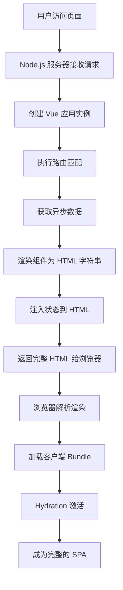

# Vue SSR 原理分析

---

## 1. 什么是 SSR？为什么需要它？

### 1.1 CSR vs SSR

**CSR（客户端渲染）：**
```javascript
// 传统 SPA 加载过程
1. 请求 HTML（空的 div#app）
2. 下载 JavaScript  bundle
3. 执行 JavaScript，渲染页面
4. 用户看到内容
```

**SSR（服务端渲染）：**
```javascript
// SSR 加载过程
1. 请求 HTML（已包含完整页面内容）
2. 下载 JavaScript bundle
3. Vue 激活（hydration），添加交互
4. 用户立即看到内容
```

### 1.2 SSR 的优势

1. **更好的 SEO**：搜索引擎可以直接抓取完整的 HTML 内容
2. **更快的首屏加载**：用户立即看到内容，无需等待 JS 下载执行
3. **更好的用户体验**：特别是对于慢网络或低性能设备

---

## 2. Vue SSR 核心原理

### 2.1 基本架构

```
客户端 (Browser) ←→ Node.js 服务器 ←→ API/数据库
       ↑                    ↑
   Hydration           SSR 渲染
```

### 2.2 核心概念：同构应用

**同构应用**是指同一套代码既在服务端运行，也在客户端运行。

```javascript
// 共享的 Vue 组件
// MyComponent.vue
<template>
  <div @click="handleClick">{{ message }}</div>
</template>

<script>
export default {
  data() {
    return { message: 'Hello SSR' }
  },
  methods: {
    handleClick() {
      this.message = 'Clicked!'
    }
  }
}
</script>
```

---

## 3. Vue SSR 完整工作流程

为了更清晰地理解整个 SSR 过程，让我们通过一个详细的流程图来展示：



### 3.1 服务端渲染阶段（步骤 1-8）

#### 步骤 1-3：创建应用实例
```javascript
// server-entry.js
import { createSSRApp } from 'vue'
import { createRouter } from './router'
import App from './App.vue'

export function createApp() {
  const app = createSSRApp(App)
  const router = createRouter()
  
  app.use(router)
  
  return { app, router }
}
```

#### 步骤 4-6：路由匹配和数据预取
```javascript
// server.js
import { renderToString } from '@vue/server-renderer'
import { createApp } from './app'

server.get('*', async (req, res) => {
  const { app, router } = createApp()
  
  // 设置服务端路由位置
  router.push(req.url)
  await router.isReady()
  
  // 数据预取
  const matchedComponents = router.currentRoute.value.matched.flatMap(record =>
    Object.values(record.components)
  )
  
  // 执行组件的 asyncData 方法
  const asyncDataResults = await Promise.all(
    matchedComponents.map(Component => {
      if (Component.asyncData) {
        return Component.asyncData({
          store,
          route: router.currentRoute.value
        })
      }
    })
  )
}
```

#### 步骤 7-8：渲染和返回 HTML
```javascript
// 继续 server.js
// 渲染为 HTML 字符串
const appContent = await renderToString(app)

// 构建完整的 HTML
const html = `
<!DOCTYPE html>
<html>
  <head>
    <title>Vue SSR App</title>
  </head>
  <body>
    <div id="app">${appContent}</div>
    <script>
      // 注入客户端需要的初始状态
      window.__INITIAL_STATE__ = ${JSON.stringify(initialState)}
    </script>
    <script src="/client-bundle.js"></script>
  </body>
</html>
`

res.send(html)
```

### 3.2 客户端激活阶段（步骤 9-12）

#### 步骤 9-12：Hydration 过程
```javascript
// client-entry.js
import { createSSRApp } from 'vue'
import { createRouter } from './router'
import App from './App.vue'

const app = createSSRApp(App)
const router = createRouter()

// 使用服务端传递的状态
if (window.__INITIAL_STATE__) {
  store.replaceState(window.__INITIAL_STATE__)
}

// Hydration（注意这里不是 mount）
app.use(router)
router.isReady().then(() => {
  app.mount('#app') // 这里执行的是 hydration，不是重新渲染
})
```

---

## 4. 关键技术细节

### 4.1 响应式数据的特殊处理

在服务端，响应式数据需要特殊处理：

```javascript
// 服务端渲染时，禁用响应式
import { shallowRef, shallowReactive } from 'vue'

export default {
  setup() {
    // 服务端使用浅层响应式，避免不必要的追踪
    const state = import.meta.env.SSR 
      ? shallowReactive({ count: 0 })
      : reactive({ count: 0 })
      
    return { state }
  }
}
```

### 4.2 生命周期差异

```javascript
export default {
  // 只在客户端执行
  mounted() {
    console.log('只在客户端执行')
  },
  
  // 服务端和客户端都执行
  created() {
    console.log('服务端和客户端都执行')
  },
  
  // SSR 专用生命周期
  serverPrefetch() {
    // 在服务端渲染前获取数据
    return this.fetchData()
  }
}
```

### 4.3 避免状态污染

```javascript
// 每个请求都需要创建新的应用实例
function createApp() {
  const app = createSSRApp(App)
  const store = createStore()
  const router = createRouter()
  
  return { app, store, router }
}

// 错误：共享实例会导致状态污染
// const app = createSSRApp(App) // ❌

// 正确：每个请求创建新实例
server.get('*', async (req, res) => {
  const { app, store, router } = createApp() // ✅
})
```

---

## 5. 数据预取和状态管理

### 5.1 数据预取策略

```javascript
// 组件内定义数据预取
export default {
  name: 'PostList',
  
  // 服务端数据预取
  async serverPrefetch() {
    await this.fetchPosts()
  },
  
  // 或者使用 asyncData（Nuxt 风格）
  async asyncData({ store, route }) {
    return await store.dispatch('fetchPosts')
  },
  
  methods: {
    async fetchPosts() {
      const posts = await api.getPosts()
      this.posts = posts
    }
  }
}
```

### 5.2 状态序列化

```javascript
// 服务端序列化状态
const initialState = store.state
const serializedState = JSON.stringify(initialState)

// 注入到 HTML
const html = `
<script>
  window.__INITIAL_STATE__ = ${serializedState}
</script>
`

// 客户端恢复状态
if (window.__INITIAL_STATE__) {
  store.replaceState(window.__INITIAL_STATE__)
}
```

---

## 6. 路由和代码分割

### 6.1 路由配置

```javascript
// router.js
import { createMemoryHistory, createWebHistory } from 'vue-router'

export function createRouter() {
  return createRouter({
    history: import.meta.env.SSR 
      ? createMemoryHistory()  // 服务端用 memory history
      : createWebHistory(),    // 客户端用 web history
    
    routes: [
      { path: '/', component: Home },
      { path: '/about', component: About }
    ]
  })
}
```

### 6.2 代码分割

```javascript
// 路由级代码分割
const Home = () => import('./components/Home.vue')
const About = () => import('./components/About.vue')

// 服务端需要等待组件加载
router.beforeResolve(async (to, from, next) => {
  const matchedComponents = to.matched.flatMap(record =>
    Object.values(record.components)
  )
  
  await Promise.all(matchedComponents.map(component => {
    if (component.__asyncLoader) {
      return component.__asyncLoader()
    }
  }))
  
  next()
})
```

---

## 7. 完整的实现示例

### 7.1 服务端入口

```javascript
// server.js
import express from 'express'
import { createSSRApp } from 'vue'
import { renderToString } from '@vue/server-renderer'
import { createRouter } from './router'
import { createStore } from './store'
import App from './App.vue'

const server = express()

server.use(express.static('dist'))

function createApp() {
  const app = createSSRApp(App)
  const router = createRouter()
  const store = createStore()
  
  app.use(router)
  app.use(store)
  
  return { app, router, store }
}

server.get('*', async (req, res) => {
  const { app, router, store } = createApp()
  
  try {
    // 设置路由
    router.push(req.url)
    await router.isReady()
    
    // 获取匹配的组件
    const matchedComponents = router.currentRoute.value.matched.flatMap(record =>
      Object.values(record.components)
    )
    
    // 执行数据预取
    await Promise.all(
      matchedComponents.map(Component => {
        if (Component.asyncData) {
          return Component.asyncData({
            store,
            route: router.currentRoute.value
          })
        }
      })
    )
    
    // 渲染应用
    const appContent = await renderToString(app)
    
    // 获取状态
    const state = store.state
    
    const html = `
<!DOCTYPE html>
<html>
  <head>
    <title>Vue SSR App</title>
  </head>
  <body>
    <div id="app">${appContent}</div>
    <script>
      window.__INITIAL_STATE__ = ${JSON.stringify(state)}
    </script>
    <script src="/client-bundle.js"></script>
  </body>
</html>
    `
    
    res.send(html)
  } catch (error) {
    console.error('SSR Error:', error)
    res.status(500).send('Server Error')
  }
})

server.listen(3000, () => {
  console.log('SSR Server running on port 3000')
})
```

### 7.2 客户端入口

```javascript
// client-entry.js
import { createSSRApp } from 'vue'
import { createRouter } from './router'
import { createStore } from './store'
import App from './App.vue'

const app = createSSRApp(App)
const router = createRouter()
const store = createStore()

// 恢复服务端状态
if (window.__INITIAL_STATE__) {
  store.replaceState(window.__INITIAL_STATE__)
}

app.use(router)
app.use(store)

router.isReady().then(() => {
  app.mount('#app')
})
```

---

## 8. 性能优化

### 8.1 缓存策略

```javascript
// 组件级别缓存
import { createRenderer } from '@vue/server-renderer'

const renderer = createRenderer({
  cache: new Map()
})

// 页面级别缓存
const microCache = new Map()

server.get('*', async (req, res) => {
  const hit = microCache.get(req.url)
  if (hit) {
    return res.send(hit)
  }
  
  // ... 渲染逻辑
  
  microCache.set(req.url, html)
  res.send(html)
})
```

### 8.2 流式渲染

```javascript
// 流式渲染提升性能
import { renderToStream } from '@vue/server-renderer'

server.get('*', async (req, res) => {
  const { app, router } = createApp()
  
  router.push(req.url)
  await router.isReady()
  
  res.setHeader('Content-Type', 'text/html')
  
  const stream = renderToStream(app)
  
  stream.on('error', (err) => {
    console.error(err)
    res.status(500).end('Internal Server Error')
  })
  
  stream.pipe(res)
})
```

---

## 9. SSR 的挑战和解决方案

### 9.1 常见挑战

1. **构建复杂度**：需要配置服务端和客户端两套构建
2. **内存泄漏**：服务端实例需要正确销毁
3. **第三方库兼容性**：有些库仅支持浏览器环境
4. **开发体验**：调试相对复杂

### 9.2 解决方案

1. **使用 Nuxt.js**：提供开箱即用的 SSR 解决方案
2. **环境变量检测**：
```javascript
if (process.server) {
  // 服务端特定代码
}

if (process.client) {
  // 客户端特定代码
}
```

3. **动态导入**：
```javascript
const clientOnlyComponent = import.meta.env.SSR 
  ? () => import('./ClientOnlyComponent.vue')
  : () => ({})
```

---

## 总结

核心原理：

1. **同构应用**：同一套代码在服务端和客户端运行
2. **服务端渲染**：Node.js 将 Vue 组件渲染为 HTML 字符串
3. **客户端激活**：Vue 在客户端"接管"服务端渲染的静态 HTML
4. **数据预取**：在服务端获取数据并序列化到客户端
5. **路由同步**：确保服务端和客户端路由状态一致

**关键优势：**
- 更好的 SEO 和首屏性能
- 更快的可交互时间
- 更好的用户体验

**适用场景：**
- SEO 要求高的页面（官网、博客、电商）
- 首屏性能要求高的应用
- 需要社交媒体分享预览
