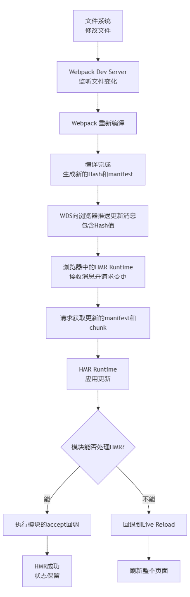

# Webpack热更新
Webpack 的热更新，通常被称为 **HMR**，是现代前端开发中提升开发体验的“杀手级”特性。它允许在运行时替换、添加或删除模块，而无需完全刷新页面。

---

### 1. 核心概念与价值

**HMR 是什么？**
HMR 是指在应用程序运行过程中，只替换修改过的模块，并**将这些变化实时地应用到浏览器中，同时保持应用程序的当前状态**（如数据、路由等）。

**与传统 Live Reload 的区别：**
*   **Live Reload:** 检测到文件变化 -> 刷新整个页面。所有状态丢失。
*   **Hot Module Replacement:** 检测到文件变化 -> 只更新变化的模块 -> 保持应用状态。

**价值：**
*   **保留应用状态：** 如表单输入、路由位置、组件状态等。
*   **节省开发时间：** 避免了每次修改后手动刷新、重新操作到之前状态的繁琐步骤。
*   **即时反馈：** 修改 CSS/JS 的反馈几乎是实时的。

---

### 2. HMR 的完整工作流程


 
这个流程涉及两个核心角色：
1.  **服务端：** Webpack Dev Server (WDS) 和 Webpack 本身。
2.  **客户端：** 浏览器中运行的、由 WDS 注入的 `HMR Runtime`。

---

### 3. 流程深度解析

#### 阶段一：服务端 - 监听与编译

1.  **启动阶段：**
    *   当执行 `webpack serve` 时，WDS 启动，并让 Webpack 以 `development` 模式进行构建。
    *   Webpack 会向入口文件注入 `HMR Runtime` 代码。这是客户端与控制端通信的桥梁。
    ```javascript
    // 打包后的bundle中会多出类似这样的代码
    if (typeof window !== 'undefined' && import.meta.webpackHot) {
      // 这是注入的HMR Runtime代码
    }
    ```

2.  **文件监听与编译：**
    *   WDS 通过 `webpack-dev-middleware` 调用 Webpack 的 API 对文件系统进行监听。
    *   当检测到文件修改时，Webpack 会**增量编译**发生变化的模块。
    *   编译完成后，Webpack 会生成一个 **`manifest`（JSON文件）** 和 **更新的代码块**。`manifest` 包含了新的编译 Hash 和所有变更模块的列表。

#### 阶段二：服务端 -> 客户端 - 推送与拉取

3.  **推送消息：**
    *   WDS 通过 **WebSocket** 连接向浏览器推送一条消息，这条消息包含了本次更新的 Hash 值。
    *   浏览器端的 `HMR Runtime` 收到消息，知道有了新的更新。

4.  **拉取资源：**
    *   `HMR Runtime` 根据收到的 Hash 值，通过 **Ajax** 向 WDS 请求 `manifest` 文件（通常是一个以 `.hot-update.json` 结尾的文件）。
    *   通过解析 `manifest`，`HMR Runtime` 知道了哪些 chunk 发生了改变，然后再去请求这些更新的 chunk 的 JavaScript 文件（通常以 `.hot-update.js` 结尾）。

#### 阶段三：客户端 - 应用更新

这是最核心、最精巧的一步。

5.  **模块热替换：**
    *   `HMR Runtime` 现在拿到了新的模块代码。它并不是直接执行新代码，而是将更新通知到 Webpack 在浏览器中维护的模块系统。
    *   Webpack 将检查**已更新的模块**，以及**这些模块的“消费者”**。

6.  **应用更新策略：**
    *   **情况A：模块“不可热更”或未处理。**
        *   如果更新的模块是“边缘”模块（如图片、Vue/React 根组件），或者没有任何父模块通过 `module.hot.accept` 声明接受它，HMR 会向上冒泡。
        *   如果一直冒泡到入口点，都没有被接受，则**回退到刷新整个页面**。

    *   **情况B：模块被“接受”。**
        *   如果更新的模块或其父模块被 `module.hot.accept` 回调捕获，则只执行该回调，进行局部的更新逻辑。
        *   **对于 Vue/React 组件：** 对应的 Loader（如 `vue-loader`）或 Plugin 已经帮我们写好了 HMR 处理逻辑。它会调用 `Vue` 或 `React` 的更新 API，替换组件实例，从而保持状态。

---

### 4. 核心原理：模块ID与模块系统

**Webpack 如何在运行时替换模块？**

1.  **模块化：** Webpack 将每个文件都包装成一个模块，并赋予一个唯一的 ID。
2.  **模块缓存：** 在浏览器中，Webpack 维护着一个 `__webpack_modules__` 对象，用于缓存所有已加载的模块。
    ```javascript
    // Webpack 生成的模块系统示例
    var __webpack_modules__ = {
      './src/index.js': (module, exports, __webpack_require__) => { /* ... */ },
      './src/utils.js': (module, exports, __webpack_require__) => { /* ... */ }
    };
    ```
3.  **替换策略：** 当 HMR 更新时，它不会删除旧的模块，而是将新的模块函数添加到 `__webpack_modules__` 中，**覆盖掉原有 ID 对应的模块函数**。当下次有模块 `require`/`import` 这个模块时，获取到的就是新的函数了。

---

### 5. 配置与使用

#### 基础配置 (`webpack.config.js`)

```javascript
const webpack = require('webpack');

module.exports = {
  // 1. 确保是开发模式
  mode: 'development',
  
  // 2. 指定入口
  entry: {
    app: ['./src/index.js']
  },
  
  devServer: {
    // 3. 开启热更新
    hot: true, // 这是最关键的一步
    // liveReload: false, // 可以关闭live reload，强制只使用HMR
    
    host: 'localhost',
    port: 8080,
  },
  
  plugins: [
    // 4. 选择性地使用 NamedModulesPlugin 或 HotModuleReplacementPlugin
    // 在 webpack 5 中，`hot: true` 会自动引入该插件
    // new webpack.HotModuleReplacementPlugin(),
  ],
};
```

#### 在应用代码中编写 HMR 接受逻辑

对于框架文件（如 Vue SFC、React 组件），对应的 loader 已经处理了 HMR。但对于普通的 JS 模块，可能需要手动处理。

```javascript
// math.js - 一个普通的工具模块
export const add = (a, b) => a + b;

// index.js - 入口文件
import { add } from './math.js';

const result = add(1, 2);
console.log(result);
document.body.innerHTML = `Result: ${result}`;

// ---------- HMR 接受逻辑 ----------
// 检查是否支持 HMR
if (import.meta.webpackHot) { // 或者 module.hot (对于 webpack < 5)
  
  // 接受自身（`./index.js`）的更新，更新后重新执行当前文件
  import.meta.webpackHot.accept((getParents) => {
    // 这个回调会在 `./index.js` 更新后执行
    // 可以在这里执行一些清理操作，或者直接重新初始化应用
    console.log('HMR: index.js updated');
    // 注意：这里不会自动重新执行模块代码，需要手动处理
  });
  
  // 接受特定依赖模块的更新，并提供一个回调来处理
  import.meta.webpackHot.accept('./math.js', (getParents) => {
    // 当 `./math.js` 更新时，这个回调会被执行
    console.log('HMR: math.js was updated!');
    // 我们可以在这里手动更新使用到 math.js 的逻辑
    const newResult = add(1, 2); // 这里 add 已经是新的函数了
    document.body.innerHTML = `New Result: ${newResult}`;
  });
  
  // 也可以接受多个依赖
  // import.meta.webpackHot.accept(['./math.js', './other.js'], ...);
}
```

---

### 6. 总结

1.  **建立连接：** 通过 WebSocket 在 WDS 和浏览器间建立双向通信。
2.  **增量构建：** Webpack 监听文件变化，并只编译改变的模块，生成更新补丁。
3.  **信息同步：** WDS 通过 WebSocket 通知浏览器有更新可用。
4.  **资源获取：** 浏览器通过 AJAX 拉取更新后的模块代码。
5.  **模块替换：** HMR Runtime 利用 Webpack 的模块系统，安全地替换掉旧的模块。
6.  **状态保持：** 通过框架特定的 HMR 处理逻辑或用户自定义的 `accept` 回调，实现局部更新而非全局刷新。
