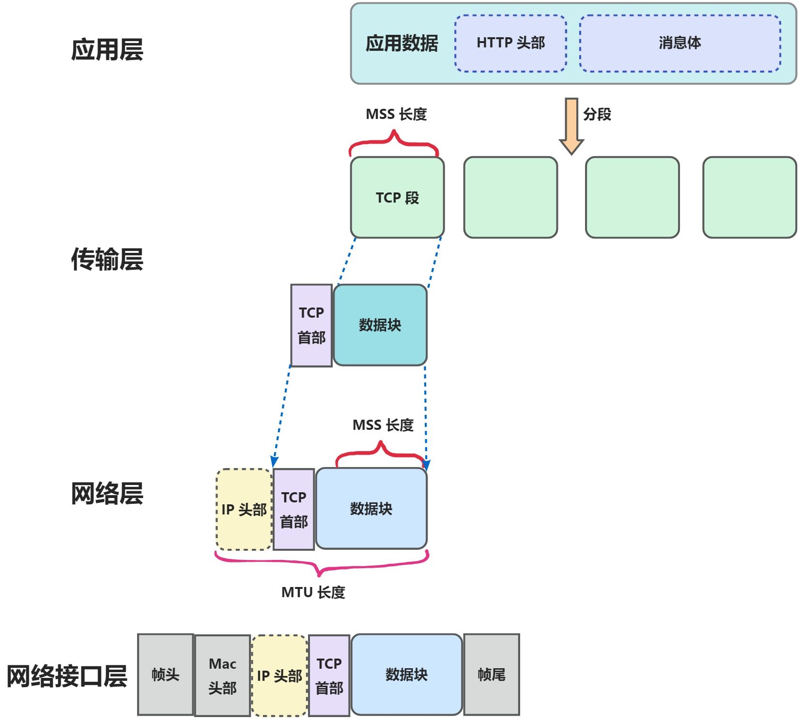
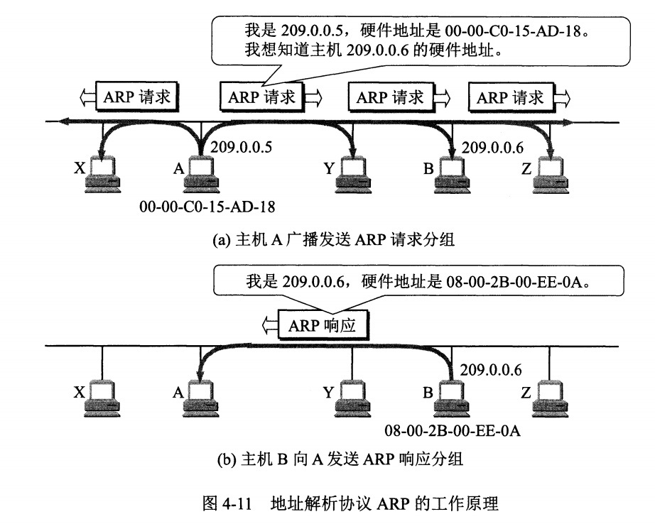

# 用户从输入网址到网页显示发生了什么
完整过程，基于五层模型图来看 (五层结构协议只是OSI和TCP/IP的综合，实际应用还是TCP/IP的四层结构)。

**示意：主机 A 访问主机 B，四层模型和五层模型对比示意图**


## 步骤

1. 浏览器输入指定网页 URL
2. 浏览器通过 DNS 协议，获取域名对应的 IP 地址
3. 浏览器根据 IP 地址和端口号，向目标服务器发起一个 TCP 连接请求
4. 浏览器在 TCP 连接上，向服务器发送一个 HTTP 请求报文，请求获取网页的内容。
5. 服务器收到 HTTP 请求报文后进行处理，再返回 HTTP 响应报文给浏览器。
6. 浏览器收到 HTTP 响应报文后，解析 HTML 代码渲染网页结构和样式，同时根据 HTML 中的资源 URL 再次发起请求获取资源内容，直至网页完全加载显示。
7. 浏览器在无需和服务器通信时，可主动关闭 TCP 连接或等待服务器关闭请求。

## 浏览器解析 URL

统一资源定位器。网络上的所有资源都靠着 URL 来定位，每一个文件就对应着一个 URL，就像是路径地址

### 组成


1. **协议类型：** URL 前缀通常有 HTTP 和 HTTPS 两种常见协议，也有如 ftp:等不常见的。
2. **域名：** 域名是网址通用名或 IP 地址的可读版本。
3. **端口：** 端口紧跟域名，用冒号隔开。
4. **资源路径：** 资源路径在域名（端口）后，从第一个/开始，早期文件常物理存储于服务器主机，现可能在云上且路径可能虚拟。
5. **参数：** 参数以键值对形式 key=value，用&隔开，含义与请求方法有关。
6. **锚点：** 锚点以#开头，是页面上的锚，不发给服务端，可定位网页位置。

## 查询本地 Host 文件/列表

浏览器在本地会维护一个 hosts 列表，一般来说浏览器要先查看要访问的域名是否在hosts列表中，如果有的话，直接提取对应的 IP 地址记录，就好了。如果本地hosts列表内没有 \[域名-IP] 对应记录的话，进行 DNS 解析

## DNS 解析

DNS (Domain Name System) 域名系统，要解决的是 ⌈域名 和 IP 地址的映射问题⌋。

DNS 是应用层协议，基于 UDP 协议之上，端口为 `53`

### 本地缓存查询

浏览器会首先检查本地缓存，依次查询：

* **浏览器缓存**：最近访问过的域名/IP 映射。
* **操作系统缓存**：操作系统维护的 DNS 缓存。
* **路由器缓存**：家庭路由器可能也会缓存常见域名的解析结果。

### 查询 DNS 服务器

**4 类层级的 DNS 服务器**

1. 根 DNS 服务器
2. 顶级域名 DNS 服务器。比如域名后缀有如com、org、net和edu等。国家也有自己的顶级域，如uk、fr和ca
3. 权威 DNS 服务器
4. 本地 DNS 服务器

如果缓存未命中，浏览器向配置的 DNS 服务器（通常是 ISP 提供的）发送查询请求，DNS 服务器会通过递归查询的方式解析域名：

1. **根 DNS 服务器**：返回顶级域名（如 `.com`）的服务器地址。
2. **顶级域名（TLD）服务器**：返回权威 DNS 服务器的地址。
3. **权威 DNS 服务器**：返回目标域名的具体 IP 地址。

解析完成后，DNS 服务器将 IP 地址返回给浏览器。该 IP 地址可能是 IPv4 地址（如 `192.168.1.1`）或 IPv6 地址（如 `2400:cb00::`）。

### DNS 两种工作查询流程

**迭代查询**

用户主机和本地 DNS 服务器逐步与其他 DNS 服务器通信，直至找到目标 IP 地址。


主机 `cis.poly.edu` 想知 `gaia.cs.umass.edu` 的 IP 地址。

`gaia.cs.umass.edu`的权威 DNS 服务器为 `dns.css.umass.edu`

1. 首先，主机 `cis.poly.edu`向本地 DNS 服务器 `dns.poly.edu` 发送一个 DNS 请求，查询报文包含被转换的域名 `gaia.cs.umass.edu`
2. 本地 DNS 服务器 `dns.poly.edu`检查缓存未发现记录，也不知道 `gaia.cs.umass.edu`的 IP 地址，转向请求根服务器
3. 根服务器发现请求报文中有 `edu` 顶级域，告知本地 DNS 可向 `edu` 的 TLD DNS 发送请求，目标域名 IP 地址可能在那里。
4. `edu` 的 TLD DNS 服务器不知请求域名 IP，见其有 `umass.edu` 前缀，告知本地 DNS 找 `umass.edu` 权威服务器。
5. 本地 DNS 向权威服务器 `dns.cs.umass.edu` 发请求。因 `gaia.cs.umass.edu` 在权威服务器备案，有其 IP 记录，权威服务器成功将 IP 返回本地 DNS。
6. 最后，本地 DNS 获目标域名 IP 返给请求主机。

**递归查询**

由本地 DNS 服务器全权负责，用户主机只与本地 DNS 服务器通信，本地 DNS 服务器将负责与其他 DNS 服务器通信并返回结果。


## 建立 TCP 连接（三次握手）

获取 IP 地址后，浏览器需要与服务器建立通信连接。通常使用 **TCP 协议**（`https` 和 `http` 均基于 TCP）。此时，浏览器通过 **Socket** 调用操作系统的网络栈发起连接请求。

### TCP 首部格式


**源端口 和 目标端口 :** 定位发送到哪个应用。

**序列号：** 解决包乱序问题

**确认号：** 确认发出去的数据包是否收到

**状态位：** SYN (发起一个连接)、ACK (回复)、RST (重新连接) 、FIN (结束连接)

**窗口大小:** 作用于流量控制

### 三次握手具体过程


1. **第一次握手**：客户端发送 **SYN**（同步序列号）包，表明希望建立连接，并随机生成一个初始序列号 `Seq=100`。
2. **第二次握手**：服务器收到 SYN 包后，返回 **SYN-ACK** 包，表示同意连接，并生成自己的序列号 `Seq=200`。
3. **第三次握手**：客户端收到 SYN-ACK 包后，再发送一个 **ACK** 包确认连接建立。

握手完成后，确保客户端和服务器双方的发送与接收能力正常。确定双方的初始序列号，为后续可靠传输做准备。客户端与服务器之间的连接正式建立，接下来即可传输数据。

### TCP 分割数据

当网络层中的 TCP 数据包大小超过 MSS（最大报文段长度）时，需要将其分割成多个 TCP 段。这些 TCP 段随后由 IP 协议封装成 IP 报文。如果 IP 报文大小超过 MTU（通常为 1500 字节），则会进一步分片成更小的 IP 报文。


## 发送 HTTP 请求

在 TCP 连接建立后，浏览器会向服务器发送 HTTP 请求，具体过程如下：

### HTTP 请求报文的组成

1. **请求行**：包括请求方法（如 GET、POST）、路径（如 `/index.html`）和协议版本（如 `HTTP/1.1`）。
2. **请求头**：包含浏览器信息（如 User-Agent）、支持的内容类型、Cookie、Host 等。
3. **请求体**：仅在 POST 请求中存在，如表单数据或 JSON 数据。

### 封装过程 - 传输层

* HTTP 请求数据被封装进 **TCP 数据包**。

双方建立连接后，TCP 报文中数据部分存放 HTTP 头部与数据，组装好后交网络层处理。


## 网络层 - IP协议远程定位

TCP 模块在执行连接、手法、断开等各阶段操作的时候，都需要委托 IP 模块将数据封装成 ⌈网络包⌋ 发送给通信对象

### IP 首部格式

关键字段：

* **协议：** 06 表示 TCP
* **源 IP 地址：** 客户端输出的 IP 地址
* **目标 IP 地址：** 即通过 DNS 域名解析得到的 Web 服务器 IP

 


如果客户端由多个网卡导致有多个 IP 地址：


根据路由表规则，判断哪一个网卡作为源地址 IP；借助路由表内的子网掩码和目标地址进行 `与运算`，得到结果如果与 `Destination`内字段一致，就是用该网卡

### IP 报文生成


## 添加 MAC 头部

MAC 头部是以太网使用的头部，它包含了接收方和发送方的 MAC 地址等信息。

 



一般在 TCP/IP 通信里，MAC 包头的协议类型只使用：

* **0800:** IP 协议
* **0806:** ARP 协议

### 如何确定发送方和接收方呢？

发送方的 MAC 地址：MAC地址在网卡生产时被写入ROM中，只需将其读出并写入MAC头部即可。

接收方的 MAC 地址: **查询路由表**

每个主机有 ARP 高速缓存，存着局域网上各主机和路由器 IP 地址到 MAC 地址映射表。若主机 A 知主机 B IP 地址但缓存无此映射，A 广播发送 ARP 请求分组，B 收后发响应分组告知 MAC 地址，A 随后写入 B 的 IP 到 MAC 映射。


工作示意图



但是ARP 缓存表中的条目通常有一定的生存时间（TTL），超过时间需要重新发送 ARP 请求。

### Linux 内查询 ARP 缓存

```json
arp -a
```


### 添加 MAC 帧头后的报文首部


## 出口 - 网卡

数字信息转换为电信号

其开头加上报头和起始帧分界符，在末尾加上用于检测错误的帧校验序列。


* 起始帧分界符：是一个用来表示包起始位置的标记
* 末尾的 `FCS`（帧校验序列）检查包传输的过程中是否有损坏

最后网卡会将包转为电信号，通过网线发送出去。

## 交换机 - 二层网络设备

在 MAC 层，电信号通过网线接口进入交换机，被转换成数字信号。经过 FCS 校验无误后，数据包会被存入缓冲区。这一过程类似于计算机网卡的操作，但交换机的工作方式有所不同。\
交换机会根据其内部维护的 MAC 地址与端口映射表查找目标 MAC 地址，并将信号发送至相应端口。若找不到目标 MAC 地址，则会将信号转发到除源端口外的所有其他端口。一旦找到目标 MAC 地址，就会将其记录到映射表中。

## 路由器 - 三层网络设备

每个端口都具有 MAC 地址和 IP 端口号

转发包时，路由器端口先接收发给自己的以太网包，查询路由表确定转发目标，再由相应端口发送出去。

 

**工作机制：**

1. 电信号到网线接口，路由器模块转成数字信号，通过包末尾 FCS 校验错误。
2. 检查 MAC 头部接收方 MAC 地址，若发给自己则放入接收缓冲区，否则丢弃。
3. **去掉** 收到报文的 MAC 头部，后取出目标地址 IP，根据 IP 内容进行包的转发
4. 查询路由表判断转发目标
5. 将表内条目子网掩码与目标 IP 做 & 运算，结果与条目目标地址匹配则为候选转发目标，不匹配则继续与下个条目进行路由匹配。
6. 若无匹配，选择默认路由，子网掩码为 `0.0.0.0`

### 路由器再发送

根据路由表网关列判断对方地址。

1. 若网关是 IP 地址，此 IP 为转发目标地址，未达终点，需路由器继续转发。
2. 若网关为空，IP 头部接收方 IP 地址即转发目标地址，找到目标地址，抵达终点。
3. 之后通过该 IP 查询对应的 MAC 依然是先查询 ARP 缓存，如果查询不到则发送 ARP 请求
4. 查询到 MAC 之后将数据包封装加上帧头和FCS用于校验的帧尾后其转换成电信号并通过端口发送出去。
5. 后续可能还会反复通过交换器和路由器

## 服务器接收请求

服务器接收到数据包后，按以下步骤处理：

### 解封装数据包

* 服务器从 MAC 帧中提取出 IP 数据包，再从 IP 数据包中提取出 TCP 数据包，最终还原为 HTTP 请求报文。

### 验证数据

* 验证目标 MAC 地址是否匹配网卡。
* 验证目标 IP 地址是否匹配服务器。
* 如果是 TCP 协议，还需验证序列号是否正确。

### 交给应用程序

* 根据端口号（如 80 或 443），将请求转发给相应的 Web 服务器（如 Nginx）。
* Web 服务器将请求转发给后端应用（如 Java、Python 编写的服务），处理业务逻辑。

## 服务器处理业务逻辑

服务器根据请求内容处理业务逻辑，可能涉及以下过程：

**静态资源**：如果请求的是静态文件（如 HTML、CSS、图片），服务器直接读取本地文件并返回。

**动态资源**：如果请求的是动态内容（如用户数据），服务器会调用后端程序。

后端程序可能需要访问数据库、缓存系统或其他服务来获取数据。

**生成 HTTP 响应**：将处理结果封装为 HTTP 响应报文，包含响应行、响应头和响应体。

## 数据返回客户端

### 封装过程

和上述封装请求一致

HTTP 响应被封装为 TCP 数据包。

TCP 数据包进一步封装为 IP 数据包和 MAC 帧。

MAC帧经过网卡转化成为电信号后开始传输

### 数据传输

与上述发送请求反向

数据包沿原路返回，经过多个路由器和交换机，最终到达客户端。

### 客户端接收

浏览器接收到数据包后，解封装提取 HTTP 响应报文。

根据响应状态码（如 200、404、500），决定下一步处理逻辑。

## 浏览器加载、解析和渲染

浏览器的构成


三种渲染引擎

1. Trident内核： IE
2. Webkit内核：Chrome,Safari
3. Gecko内核：FireFox

### 解析和渲染


包括：

1. 解析 html 生成 dom 树
2. 解析 css 生成 cssom 树
3. 将 dom 树和 cssom 树合并形成渲染树
4. 遍历渲染树开始布局和计算
5. 绘制渲染树，显示到屏幕
6. Repaint 和 Reflow 当用户在浏览网页时进行交互或通过 js 脚本改变页面结构时，以上的部分操作有可能重复运行，此过程称为 Repaint 或 Reflow。

## 用户看到网页

经过上述步骤，浏览器将完整网页渲染到屏幕上，用户即可看到并交互。
